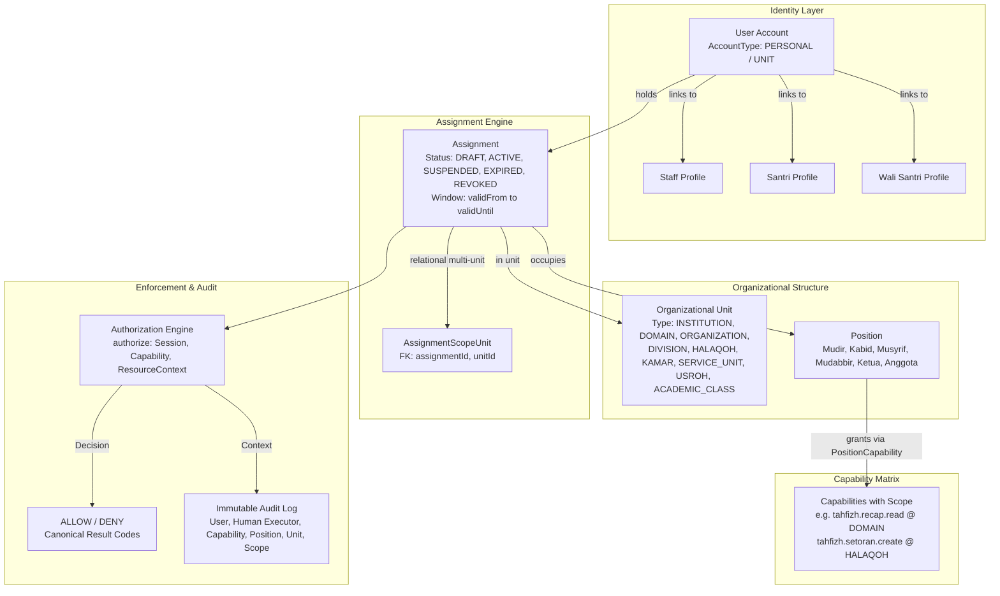

# STQ ARCHITECTURE LOCK — PHASE 1 MASTER SPECIFICATION
**Canonical Identity, Organizational Unit, Assignment, Capability, and Scope Architecture**  
**Repository**: `abdngr23-pixel/stq-education-portal`  
**Baseline Commit**: `4c73317ba8d32924d1e86da2a7f2ef29f6aa0986`  
**Working Branch**: `architecture/stq-lock-phase1`  
**Status**: `PROPOSED — PENDING BUSINESS OWNER / CHATGPT REVIEW`  
**PR #8 Integrity**: Untouched (`HEAD 9068cae5587b7219c394c5c25bf0de07a15b0726`)

---

## 1. Executive Summary & Purpose

The **STQ Architecture Lock** establishes the canonical authorization, identity, and organizational structure for the STQ Education Portal (Pesantren Darul Ulum Cendekia).

Prior to this Lock, the portal evolved through rapid feature increments where authorization was frequently coupled to coarse `Role` enums, ad-hoc boolean flags on staff/user records (e.g., `Staff.isKepalaBidangTahfidz`, `User.isPetugasPresensiPutri`), and implicit assumptions about operational accounts. While hotfixes (PR #10 through PR #13) successfully secured baseline ABAC boundaries and eliminated false health data, the system required a definitive architecture to eliminate:
1. **Role Proliferation**: Attempting to model every operational responsibility (e.g., Mudabbir, OSDA Petugas Kesehatan, Pembina Divisi, Petugas Dapur) as a global `Role` enum.
2. **Ad-hoc Flags**: Adding boolean columns to `User` or `Staff` tables whenever a staff member or student receives a distinct operational role.
3. **Implicit & Person-Name Heuristics**: Relying on person identity, display names, or username patterns instead of verified active organizational assignments.
4. **Coarse Permissions**: Using a single `CRUD` permission matrix that fails to express nuanced boundaries (e.g., read vs create vs update medical records; managerial read vs operational write in tahfizh).
5. **Speculative Policy Creep**: Conflating technical authorization mechanisms with unapproved future institutional business policies.

The STQ Architecture Lock defines a comprehensive, deterministic, fail-closed model:
```
IDENTITY  +  ORGANIZATIONAL UNIT  +  POSITION  +  ASSIGNMENT  +  CAPABILITY  +  SCOPE
                                        ↓
                              AUTHORIZATION ENGINE
                                        ↓
                        SERVER-SIDE POLICY ENFORCEMENT
                                        ↓
                         UI DERIVATION & AUDIT LOGGING
```

### 1.1. Hierarchy of Authority & Precedence Rules

To prevent specification drift across code contracts, database models, and documentation, the STQ Architecture Lock defines a strict 3-level Hierarchy of Authority:

1. **Level 1 — Executable Contract Source of Truth**:
   - Primary File: [`types/architecture-lock.ts`](file:///d:/stq-education-portal-antigravity/stq-education-portal/types/architecture-lock.ts)
   - Scope: Machine-checked TypeScript interfaces, enums, unions, type aliases, and engine method signatures.
   - Authority: In any conflict between prose and Level 1 type definitions, **Level 1 is authoritative**.

2. **Level 2 — Master Architecture & Boundary Specification**:
   - Primary File: [`docs/STQ_ARCHITECTURE_LOCK.md`](file:///d:/stq-education-portal-antigravity/stq-education-portal/docs/STQ_ARCHITECTURE_LOCK.md) (This document)
   - Scope: Overarching architectural principles, non-negotiable invariants, security boundaries, institutional tree topology, and business rule classification.
   - Authority: Defines the canonical policy boundary; all subordinate documents must conform strictly to Level 2.

3. **Level 3 — Specialized Domain Deep-Dives**:
   - Subordinate Files: [`STQ_AUTHORIZATION_MODEL.md`](file:///d:/stq-education-portal-antigravity/stq-education-portal/docs/STQ_AUTHORIZATION_MODEL.md), [`STQ_ASSIGNMENT_MODEL.md`](file:///d:/stq-education-portal-antigravity/stq-education-portal/docs/STQ_ASSIGNMENT_MODEL.md), [`STQ_CAPABILITY_CATALOG.md`](file:///d:/stq-education-portal-antigravity/stq-education-portal/docs/STQ_CAPABILITY_CATALOG.md), [`STQ_SCOPE_MODEL.md`](file:///d:/stq-education-portal-antigravity/stq-education-portal/docs/STQ_SCOPE_MODEL.md), [`STQ_COMPATIBILITY_MAP.md`](file:///d:/stq-education-portal-antigravity/stq-education-portal/docs/STQ_COMPATIBILITY_MAP.md), [`STQ_ARCHITECTURE_MIGRATION_PLAN.md`](file:///d:/stq-education-portal-antigravity/stq-education-portal/docs/STQ_ARCHITECTURE_MIGRATION_PLAN.md), [`STQ_ARCHITECTURE_INVARIANTS.md`](file:///d:/stq-education-portal-antigravity/stq-education-portal/docs/STQ_ARCHITECTURE_INVARIANTS.md), [`STQ_ARCHITECTURE_DECISION_LOG.md`](file:///d:/stq-education-portal-antigravity/stq-education-portal/docs/STQ_ARCHITECTURE_DECISION_LOG.md).
   - Scope: Topic-specific implementation guidance, candidate database migration schemas, compatibility mapping tables, and ADRs.
   - Authority: Subordinate to Level 1 and Level 2; must maintain 100% terminological parity.

---

## 2. Non-Negotiable Core Principles

1. **Global Role is a Coarse Identity Category, Not an Organizational Position**:
   - `Role` represents the base technical category of a credential (`STAFF`, `SANTRI`, `WALI`, `UNIT_ACCOUNT`).
   - Functional authorities (e.g. Mudir, Kabid Tahfizh, Musyrif Keasramaan, Mudabbir, Pembina Divisi, Ketua OSDA) are **Positions** held via active **Assignments**, not roles.
2. **Zero Person-Name / Username Heuristics**:
   - A person's name or username must NEVER confer authority.
   - Ust. Razan has supervisory access solely because he holds an active Assignment to `Position: KABID_TAHFIZH` in `Unit: TAHFIZH` (`Scope: DOMAIN`).
   - Ustadzah Lisa has halaqoh-scoped access solely because she holds an active Assignment to `Position: MUSYRIF_TAHFIZH` in `Unit: HALAQOH_LISA` (`Scope: HALAQOH`).
3. **Server-Side Enforcement is Authoritative**:
   - UI hiding or disabling buttons is an ergonomics layer only.
   - All mutations and queries are enforced fail-closed at the Server Action / API layer.
4. **Capability is Evaluated Before Scope**:
   - Holding a `GLOBAL` scope on a specific capability (e.g. `health.case.read_aggregate + GLOBAL`) confers zero authority over unrelated capabilities (e.g. `tahfizh.reward.issue`). `GLOBAL` denotes institutional scope for the granted capability only.
5. **Principle of Least Privilege (PoLP) & Domain Enclosure**:
   - Institutional READ authority (e.g., Kabid Tahfizh supervision) does NOT automatically grant cross-unit WRITE authority (e.g., Setoran creation).
   - Setoran creation remains enclosed to the musyrif's own halaqoh binaan.
6. **Separation of Personal and Unit Accounts**:
   - Asatidz, Asatidzah, and Santri use individual personal accounts (`AccountType: PERSONAL`).
   - Operational desks (OSDA divisions, TKS units, poskestren kiosk) utilize designated unit accounts (`AccountType: UNIT`), where every mutating transaction MUST attribute both the **Technical Account** and the authenticated **Human Executor** (`humanExecutorId` verified against active records).
7. **Additive, Controlled Evolution**:
   - Zero database migrations or breaking schema mutations in Phase 1.
   - Compatibility adapters maintain 100% parity with verified production behavior.

---

## 3. Structural Model Overview



---

## 4. Hierarchy of Organizational Units

### 4.1. Normalized OrgUnit Vocabulary
The system uses exactly ONE canonical `OrgUnitType` vocabulary across all TypeScript contracts, database schemas, and documentation:
1. `INSTITUTION`: Root pesantren entity (STQ Darul Ulum Cendekia).
2. `DOMAIN`: Strategic division (Tahfizh, Keasramaan, Akademik, Manajemen).
3. `ORGANIZATION`: Structured umbrella bodies (e.g. OSDA - Organisasi Santri Darul Ulum Cendekia).
4. `DIVISION`: Functional wings within an organization (e.g. Divisi Keamanan, Divisi Kesehatan).
5. `HALAQOH`: Qur'anic study circle grouping students under an assigned musyrif.
6. `KAMAR`: Dormitory room grouping students under an assigned Mudabbir.
7. `SERVICE_UNIT`: Operational service unit under TKS (Dapur, Masjid, Air Minum).
8. `USROH`: Small student taskforce (e.g. daily cleaning rotation under OSDA Kebersihan).
9. `ACADEMIC_CLASS`: Instructional academic classroom (e.g. Kelas 7A, 7B).

### 4.2. Institutional Tree: STQ Darul Ulum Cendekia
```
STQ Darul Ulum Cendekia (Type: INSTITUTION)
│
├── 1. Direktorat / Pimpinan (Type: DOMAIN)
│
├── 2. Bidang Ketahfidzhan (Type: DOMAIN)
│   ├── Kabid Tahfizh (Position: KABID_TAHFIZH)
│   └── Halaqoh-Halaqoh Qur'an (Type: HALAQOH)
│       ├── Halaqoh Ust. Razan Mufli (Putra)
│       ├── Halaqoh Ust. Zaid (Putra)
│       ├── Halaqoh Ust. Kamal (Putra)
│       ├── Halaqoh Ust. Alwan (Putra)
│       └── Halaqoh Ustadzah Lisa Dwina Fitri (Putri)
│
├── 3. Bidang Keasramaan & Kesantrian (Type: DOMAIN)
│   ├── Kepala Keasramaan / Musyrif Keasramaan
│   │
│   ├── Kamar-Kamar Asrama (Type: KAMAR)
│   │   ├── Kamar Abu Bakar (Mudabbir A)
│   │   ├── Kamar Umar bin Khattab (Mudabbir A)
│   │   ├── Kamar Utsman bin Affan (Mudabbir B)
│   │   └── Kamar Putri (Mudabbir Putri)
│   │
│   ├── Organisasi Santri Darul Ulum Cendekia - OSDA (Type: ORGANIZATION)
│   │   ├── Pimpinan Harian (Type: DIVISION)
│   │   └── Divisi-Divisi OSDA (Type: DIVISION)
│   │       ├── Divisi Keamanan & Kedisiplinan
│   │       ├── Divisi Pendidikan & Ibadah
│   │       ├── Divisi Kebersihan & Kerapihan (Membina Usroh, Type: USROH)
│   │       ├── Divisi Kesehatan (Poskestren)
│   │       ├── Divisi Sarana & Prasarana (Sarpras)
│   │       └── Divisi Multimedia
│   │
│   └── Tenaga Kebersihan & Servis - TKS (Type: ORGANIZATION)
│       ├── Unit Dapur & Gizi (Type: SERVICE_UNIT)
│       ├── Unit Masjid (Type: SERVICE_UNIT)
│       ├── Unit Kantor Pendidikan (Type: SERVICE_UNIT)
│       ├── Unit Kantor Yayasan (Type: SERVICE_UNIT)
│       ├── Unit Air Minum (Type: SERVICE_UNIT)
│       └── Unit Air Sumur (Type: SERVICE_UNIT)
│
├── 4. Bidang Akademik & Kurikulum (Type: DOMAIN)
│   └── Kelas-Kelas Akademik (Type: ACADEMIC_CLASS, 7A, 7B, 8A, 8B)
│
└── 5. Administrasi, Keuangan & Tata Usaha (Type: DOMAIN)
    ├── Staf Tata Usaha / Admin
    └── Pengelolaan Sponsor / Orang Tua Asuh
```

---

## 5. Summary of Business Boundaries & Invariants

### 5.1. Verified & Locked Invariants
| Domain | Action / Resource | Verified Authority Baseline | Enforcement Rule |
| :--- | :--- | :--- | :--- |
| **Tahfizh** | Setoran Creation | Strict Halaqoh Enclosure: Musyrif and Kabid may only create setoran for students in their assigned halaqoh. | `authorize(session, 'tahfizh.setoran.create', { halaqohId })` |
| **Tahfizh** | Tasmi'/Sima'an Reward | Authorized strictly to Mudir (`KS`) and Kabid Tahfizh (`Position: KABID_TAHFIZH`). Ordinary MT, ADM, MK, PH strictly denied. | `hasCapability(session, 'tahfizh.reward.issue')` |
| **Tahfizh** | Reward Policy Edit | Authorized solely to Mudir (`KS`). Kabid and ordinary MT denied. | `hasCapability(session, 'tahfizh.policy.manage')` |
| **Tahfizh** | Supervision Recap | Authorized to Mudir, Kabid Tahfizh, and Admin. Ordinary MT sees only own halaqoh. | `resolveScopes(session, 'tahfizh.recap.read')` |
| **Kesehatan** | Aggregate Health Read | Dashboard counts & health overview. Global: Mudir, Musyrif Keasramaan, Poskestren. Scoped: Pembina Asrama (assigned kamar), Wali (own child relationally). | `authorize(session, 'health.case.read_aggregate', context)` |
| **Kesehatan** | Clinical Detail Read | Full medical record & diagnosis details. Restricted to Mudir, Musyrif Keasramaan, Poskestren, and Pembina Asrama (assigned kamar). Teachers and generic OSDA denied. | `authorize(session, 'health.case.read_detail', context)` |
| **Kesehatan** | Intake Case Create | Initial complaint & symptom recording. Authorized to Mudir, Musyrif Keasramaan, Poskestren, Pembina Asrama. Generic OSDA denied. | `authorize(session, 'health.case.create', context)` |
| **Kesehatan** | Status Update | Updating clinical status (`DIPANTAU`, `PULIH`, `DIRUJUK`, `DARURAT`). Authorized to Mudir, Musyrif Keasramaan, and Poskestren. Admin TU strictly denied (`DENY`); generic OSDA denied. | `authorize(session, 'health.case.update_status', context)` |
| **Kesehatan** | External Referral | Issuing official clinical referral to Puskesmas / Hospital. Authorized to Mudir and Poskestren. Admin TU and generic OSDA denied. | `authorize(session, 'health.case.referral', context)` |
| **Kesehatan** | Data Honesty | Zero synthetic "Sehat" fallbacks. Error = "Gagal memuat", Empty = "Belum ada data", Healthy = "Sehat". | Canonical health semantics |
| **Kesehatan** | V2 Medical Statuses | Canonical V2 statuses: `DIPANTAU`, `PULIH`, `DIRUJUK`, `DARURAT`. Old terms (`RAWAT_PONDOK`, `PULANG`, etc.) retained only as legacy read bridges. | V2 Health Status Model |
| **Keasramaan**| Mudabbir Identity | Mudabbir ≠ PH, Mudabbir ≠ MT, Mudabbir ≠ generic OSDA. Authority derives strictly from Kamar assignment. | Independent Position `MUDABBIR` |

### 5.2. Proposed Capabilities (TBD — Pending Business Owner Approval)
The following capabilities represent architectural design proposals whose assignment matrices remain **TBD** pending formal Business Owner review:
- `tahfizh.setoran.cancel`: Operational cancellation workflow.
- `tahfizh.target.manage`: Individual target setting.
- `tahfizh.ikhtibar.evaluate_s1` / `_s2`: Examination hierarchy.
- `keasramaan.permission.create` / `approve_mk` / `approve_ks`: Two-tier leave workflow.
- `keasramaan.discipline.create` / `sp.issue` / `sp.whitewash`: Mudabbir disciplinary limits.
- `academic.*`: Teacher grading matrix and report card publishing.
- `logistics.*`, `finance.*`, `letters.*`, `sponsor.*`: External workflows.
- `system.assignment.manage`: Staff assignment administrative rights.

---

## 6. Document Sitemap

1. [`docs/STQ_ARCHITECTURE_LOCK.md`](file:///d:/stq-education-portal-antigravity/stq-education-portal/docs/STQ_ARCHITECTURE_LOCK.md) — Master Architecture Document (This document)
2. [`docs/STQ_AUTHORIZATION_MODEL.md`](file:///d:/stq-education-portal-antigravity/stq-education-portal/docs/STQ_AUTHORIZATION_MODEL.md) — Authorization Engine, Evaluation Algorithms & API Contracts
3. [`docs/STQ_ASSIGNMENT_MODEL.md`](file:///d:/stq-education-portal-antigravity/stq-education-portal/docs/STQ_ASSIGNMENT_MODEL.md) — Organizational Units, Positions, Assignments & Kiosk Accounts
4. [`docs/STQ_CAPABILITY_CATALOG.md`](file:///d:/stq-education-portal-antigravity/stq-education-portal/docs/STQ_CAPABILITY_CATALOG.md) — Exhaustive Catalog of Fine-Grained Capabilities & Naming Rules
5. [`docs/STQ_SCOPE_MODEL.md`](file:///d:/stq-education-portal-antigravity/stq-education-portal/docs/STQ_SCOPE_MODEL.md) — Resource Scopes, Context Binding & Boundaries
6. [`docs/STQ_COMPATIBILITY_MAP.md`](file:///d:/stq-education-portal-antigravity/stq-education-portal/docs/STQ_COMPATIBILITY_MAP.md) — Legacy Role & Flag Mapping to Future Assignments
7. [`docs/STQ_ARCHITECTURE_MIGRATION_PLAN.md`](file:///d:/stq-education-portal-antigravity/stq-education-portal/docs/STQ_ARCHITECTURE_MIGRATION_PLAN.md) — 5-Phase Additive Zero-Downtime Migration Strategy
8. [`docs/STQ_ARCHITECTURE_INVARIANTS.md`](file:///d:/stq-education-portal-antigravity/stq-education-portal/docs/STQ_ARCHITECTURE_INVARIANTS.md) — Comprehensive System Invariants & Non-Regressible Rules
9. [`docs/STQ_ARCHITECTURE_DECISION_LOG.md`](file:///d:/stq-education-portal-antigravity/stq-education-portal/docs/STQ_ARCHITECTURE_DECISION_LOG.md) — Formal Architecture Decision Records (ADR-001 to ADR-008)
