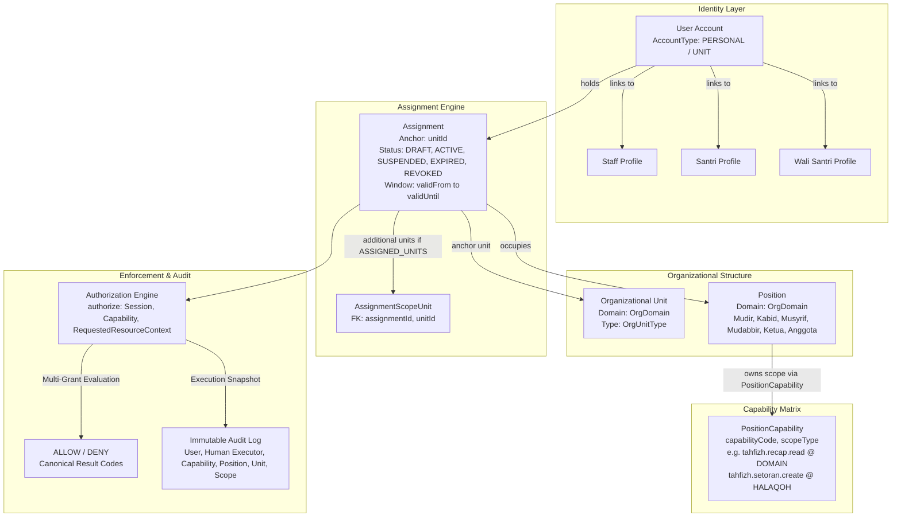

# STQ ARCHITECTURE LOCK — PHASE 1 MASTER SPECIFICATION
**Canonical Identity, Organizational Unit, Assignment, Capability, and Scope Architecture**  
**Repository**: `abdngr23-pixel/stq-education-portal`  
**Baseline Commit**: `4c73317ba8d32924d1e86da2a7f2ef29f6aa0986`  
**Working Branch**: `architecture/stq-lock-phase1`  
**Status**: `PROPOSED — PENDING BUSINESS OWNER / CHATGPT REVIEW`  
**PR #8 Integrity**: Untouched (`HEAD 9068cae5587b7219c394c5c25bf0de07a15b0726`)

---

## 1. Executive Summary & Purpose

The **STQ Architecture Lock** establishes the canonical authorization, identity, and organizational structure for the STQ Education Portal (Pesantren Darul Ulum Cendekia).

Prior to this Lock, the portal evolved through rapid feature increments where authorization was frequently coupled to coarse `Role` enums, ad-hoc boolean flags on staff/user records (e.g., `Staff.isKepalaBidangTahfidz`, `User.isPetugasPresensiPutri`), and implicit assumptions about operational accounts. While hotfixes (PR #10 through PR #13) successfully secured baseline ABAC boundaries and eliminated false health data, the system required a definitive architecture to eliminate:
1. **Role Proliferation**: Attempting to model every operational responsibility (e.g., Mudabbir, OSDA Petugas Kesehatan, Pembina Divisi, Petugas Dapur) as a global `Role` enum.
2. **Ad-hoc Flags**: Adding boolean columns to `User` or `Staff` tables whenever a staff member or student receives a distinct operational role.
3. **Implicit & Person-Name Heuristics**: Relying on person identity, display names, or username patterns instead of verified active organizational assignments.
4. **Coarse Permissions**: Using a single `CRUD` permission matrix that fails to express nuanced boundaries (e.g., read vs create vs update medical records; managerial read vs operational write in tahfizh).
5. **Speculative Policy Creep**: Conflating technical authorization mechanisms with unapproved future institutional business policies.

The STQ Architecture Lock defines a comprehensive, deterministic, fail-closed model:
```
IDENTITY  +  ORGANIZATIONAL UNIT  +  POSITION  +  ASSIGNMENT  +  CAPABILITY  +  SCOPE
                                        ↓
                              AUTHORIZATION ENGINE
                                        ↓
                        SERVER-SIDE POLICY ENFORCEMENT
                                        ↓
                         UI DERIVATION & AUDIT LOGGING
```

### 1.1. Hierarchy of Authority & Precedence Rules

To prevent specification drift across code contracts, database models, and documentation, the STQ Architecture Lock defines a strict Hierarchy of Authority:

1. **Level 1 — Technical Contract Source of Truth**:
   - Primary File: [`types/architecture-lock.ts`](file:///d:/stq-education-portal-antigravity/stq-education-portal/types/architecture-lock.ts)
   - Scope: Machine-checked TypeScript interfaces, data shapes, enums, unions, type aliases, and engine method signatures.
   - Authority: Canonical compile-time and runtime technical contracts.

2. **Level 2 — Master Architecture & Boundary Specification**:
   - Primary File: [`docs/STQ_ARCHITECTURE_LOCK.md`](file:///d:/stq-education-portal-antigravity/stq-education-portal/docs/STQ_ARCHITECTURE_LOCK.md) (This document)
   - Scope: Approved system invariants, non-negotiable boundaries, institutional tree topology, and business rule classification.
   - Authority: Defines the canonical policy boundary; all subordinate documents must conform strictly to Level 2.

3. **Level 3 — Business Policy Governance & State Demarcation**:
   - Capabilities and authority assignments are strictly governed by their explicit **`BusinessRuleState`** (`VERIFIED_PRODUCTION`, `APPROVED_TARGET_PENDING_TECHNICAL`, `PROPOSED_TBD`).
   - Entries marked `PROPOSED_TBD` are illustrative technical placeholders and do **NOT** constitute approved institutional policy.

4. **Level 4 — Specialized Domain Deep-Dives**:
   - Subordinate Files: [`STQ_AUTHORIZATION_MODEL.md`](file:///d:/stq-education-portal-antigravity/stq-education-portal/docs/STQ_AUTHORIZATION_MODEL.md), [`STQ_ASSIGNMENT_MODEL.md`](file:///d:/stq-education-portal-antigravity/stq-education-portal/docs/STQ_ASSIGNMENT_MODEL.md), [`STQ_CAPABILITY_CATALOG.md`](file:///d:/stq-education-portal-antigravity/stq-education-portal/docs/STQ_CAPABILITY_CATALOG.md), [`STQ_SCOPE_MODEL.md`](file:///d:/stq-education-portal-antigravity/stq-education-portal/docs/STQ_SCOPE_MODEL.md), [`STQ_COMPATIBILITY_MAP.md`](file:///d:/stq-education-portal-antigravity/stq-education-portal/docs/STQ_COMPATIBILITY_MAP.md), [`STQ_ARCHITECTURE_MIGRATION_PLAN.md`](file:///d:/stq-education-portal-antigravity/stq-education-portal/docs/STQ_ARCHITECTURE_MIGRATION_PLAN.md), [`STQ_ARCHITECTURE_INVARIANTS.md`](file:///d:/stq-education-portal-antigravity/stq-education-portal/docs/STQ_ARCHITECTURE_INVARIANTS.md), [`STQ_ARCHITECTURE_DECISION_LOG.md`](file:///d:/stq-education-portal-antigravity/stq-education-portal/docs/STQ_ARCHITECTURE_DECISION_LOG.md).
   - Must maintain 100% terminological parity with Levels 1, 2, and 3.

---

## 2. Non-Negotiable Core Principles

1. **Legacy Role is Coarse Compatibility Metadata, Not Canonical Authority**:
   - Current `Role` enum (`KS`, `MT`, `MK`, `ADM`, `PH`, `OSDA`, `WS`, `ST`, etc.) is legacy compatibility metadata.
   - Credential modality is represented separately by `AccountType` (`PERSONAL` | `UNIT`).
   - Organizational responsibilities are **Positions** held via active **Assignments**, not roles.
2. **Zero Person-Name / Username Heuristics**:
   - A person's name or username must NEVER confer authority.
   - Authority derives strictly from database-backed `Assignments` and `PositionCapabilities`.
3. **Server-Side Enforcement is Authoritative**:
   - UI hiding or disabling buttons is an ergonomics layer only.
   - All mutations and queries are enforced fail-closed at the Server Action / API layer.
4. **Capability is Evaluated Before Scope**:
   - Holding a `GLOBAL` scope on a specific capability (e.g. `health.case.read_aggregate + GLOBAL`) confers zero authority over unrelated capabilities (e.g. `tahfizh.reward.issue`). `GLOBAL` denotes institutional scope for the granted capability only.
5. **Single Source of Truth for Scope**:
   - `PositionCapability.scopeType` is the single source of truth for scope containment.
   - `Assignment` stores anchor `unitId` and lifecycle state, but **NO** `scopeType`.
   - `AssignmentScopeUnit` binds additional permitted units when scope is `ASSIGNED_UNITS`.
6. **Multi-Grant Evaluation**:
   - A user may hold multiple assignments conferring the same capability with different scopes.
   - `resolveScopes()` returns `EffectiveCapabilityGrant[]`.
   - `authorize()` evaluates all active grants and allows access if at least one grant matches.
7. **Strict Trust Boundary on Resource Context**:
   - Callers submit untrusted `RequestedResourceContext` (target IDs only).
   - The engine evaluates server-hydrated `ResolvedResourceContext` (database-verified boundaries, `guardianLinkedSantriIds`). Callers can never supply or influence permitted child IDs.
8. **Separation of Personal and Unit Accounts**:
   - Asatidz, Asatidzah, and Santri use personal accounts (`AccountType: PERSONAL`).
   - Operational desks utilize designated unit accounts (`AccountType: UNIT`), where every mutating transaction MUST attribute both the **Technical Account** and authenticated **Human Executor** (`humanExecutorId` verified against active records).
9. **Additive, Controlled Evolution**:
   - Zero production migrations or breaking schema mutations in Phase 1.
   - Candidate persistence in Phase A adds `User.accountType` non-destructively.

---

## 3. Structural Model Overview



---

## 4. Hierarchy of Organizational Units

### 4.1. OrgDomain vs. CapabilityNamespace Decoupling
The STQ architecture cleanly decouples structural organizational domains from functional capability namespaces:

1. **`OrgDomain`** (5 Structural Branches):
   - `INSTITUTIONAL`: Root leadership & Yayasan.
   - `TAHFIZH`: Qur'anic education & halaqoh circles.
   - `KEASRAMAAN`: Residential boarding, student life, discipline, mudabbir, OSDA, TKS, and Poskestren.
   - `AKADEMIK`: Instructional classes and curriculum.
   - `MANAJEMEN`: Administration, Finance, HR, Logistics, and external relations.
   *(Note: Poskestren/Health and TKS are structurally enclosed under `KEASRAMAAN`).*

2. **`CapabilityNamespace`** (9 Functional Action Namespaces):
   - `TAHFIZH`, `KEASRAMAAN`, `HEALTH`, `ACADEMIC`, `LOGISTICS`, `FINANCE`, `LETTERS`, `SPONSOR`, `SYSTEM`.

### 4.2. Normalized OrgUnit Vocabulary
The system uses exactly ONE canonical `OrgUnitType` vocabulary:
1. `INSTITUTION`: Root pesantren entity (STQ Darul Ulum Cendekia).
2. `DOMAIN`: Strategic division (Tahfizh, Keasramaan, Akademik, Manajemen).
3. `ORGANIZATION`: Structured umbrella bodies (`OSDA`, `TKS`).
4. `DIVISION`: Functional wings within an organization (e.g. Divisi Keamanan, Divisi Kesehatan).
5. `HALAQOH`: Qur'anic study circle grouping students under an assigned musyrif.
6. `KAMAR`: Dormitory room grouping students under an assigned Mudabbir.
7. `SERVICE_UNIT`: Operational service unit under TKS (Dapur dan Gizi, Masjid, Air Minum, Air Sumur, dll.).
8. `USROH`: Small student taskforce (e.g. daily cleaning rotation under OSDA Kebersihan).
9. `ACADEMIC_CLASS`: Instructional academic classroom (e.g. Kelas 7A, 7B).

### 4.3. Institutional Tree: STQ Darul Ulum Cendekia
```
STQ Darul Ulum Cendekia (Type: INSTITUTION)
│
├── 1. Direktorat / Pimpinan (Domain: INSTITUTIONAL)
│
├── 2. Bidang Ketahfidzhan (Domain: TAHFIZH)
│   ├── Kabid Tahfizh (Position: KABID_TAHFIZH)
│   └── Halaqoh-Halaqoh Qur'an (Type: HALAQOH, authoritatively backfilled from database)
│       ├── [Illustrative] Halaqoh Putra A
│       ├── [Illustrative] Halaqoh Putra B
│       └── [Illustrative] Halaqoh Putri A
│
├── 3. Bidang Keasramaan & Kesantrian (Domain: KEASRAMAAN)
│   ├── Kepala Keasramaan / Musyrif Keasramaan
│   │
│   ├── Kamar-Kamar Asrama (Type: KAMAR, authoritatively backfilled from dormitory structure)
│   │   ├── [Illustrative] Kamar Asrama Banin 1 (Mudabbir Banin)
│   │   ├── [Illustrative] Kamar Asrama Banin 2 (Mudabbir Banin)
│   │   └── [Illustrative] Kamar Asrama Banat 1 (Mudabbir Banat)
│   │
│   ├── Organisasi Santri Darul Ulum Cendekia - OSDA (Type: ORGANIZATION)
│   │   ├── Pengurus Inti OSDA (Type: DIVISION)
│   │   │   ├── Ketua OSDA
│   │   │   ├── Sekretaris OSDA
│   │   │   ├── Bendahara OSDA
│   │   │   └── Bagian Multimedia
│   │   │
│   │   └── Divisi-Divisi Operasional OSDA (Type: DIVISION)
│   │       ├── Divisi Keamanan & Kedisiplinan
│   │       ├── Divisi Pendidikan & Ibadah
│   │       ├── Divisi Kebersihan & Kerapihan (Membina Usroh, Type: USROH)
│   │       ├── Divisi Kesehatan (Poskestren UKS)
│   │       └── Divisi Sarana & Prasarana (Sarpras)
│   │
│   └── Tugas Khusus Santri - TKS (Type: ORGANIZATION)
│       ├── Unit Dapur dan Gizi (Type: SERVICE_UNIT, Peran: KETUA_UNIT, ANGGOTA_UNIT)
│       ├── Unit Masjid (Type: SERVICE_UNIT, Peran: KETUA_UNIT, ANGGOTA_UNIT)
│       ├── Unit Kantor Pendidikan (Type: SERVICE_UNIT, Peran: OPERATOR_UNIT)
│       ├── Unit Kantor Yayasan (Type: SERVICE_UNIT, Peran: OPERATOR_UNIT)
│       ├── Unit Air Minum (Type: SERVICE_UNIT, Peran: OPERATOR_UNIT)
│       └── Unit Air Sumur (Type: SERVICE_UNIT, Peran: OPERATOR_UNIT)
│       *(Catatan: Air Minum dan Air Sumur merupakan unit terpisah; TKS tidak memiliki Ketua Umum terpusat).*
│
├── 4. Bidang Akademik & Kurikulum (Domain: AKADEMIK)
│   └── Kelas-Kelas Akademik (Type: ACADEMIC_CLASS, 7A, 7B, 8A, 8B)
│
└── 5. Administrasi, Keuangan & Tata Usaha (Domain: MANAJEMEN)
    ├── Staf Tata Usaha / Admin
    └── Pengelolaan Sponsor / Orang Tua Asuh
```

---

## 5. Summary of Business Boundaries & Invariants

### 5.1. The Three Canonical Business Rule States at the Grant/Policy Level
All authorization rules and capability grants are strictly classified into one of three canonical business-rule states. Crucially, **`BusinessRuleState` belongs to the policy/grant mapping (`PositionCapability`), NOT to the semantic capability definition (`Capability`)**.

A single semantic `Capability` (e.g. `health.case.create`) defines only what the action is (`code`, `namespace`, `name`, `description`, `isDangerous`). It cannot have a single ruleState because different position grants for that same capability exist in different lifecycle phases:
- `health.case.create` granted to `Musyrif Keasramaan` (`MK`) / `Admin` (`ADM`) = **`VERIFIED_PRODUCTION`**
- `health.case.create` granted to `Petugas Kesehatan` = **`APPROVED_TARGET_PENDING_TECHNICAL`**

The three canonical states governing policy grants:

1. **`VERIFIED_PRODUCTION`**:
   - Rules, capabilities, and grants that have been observed, validated, and proven in active production runtime (PR #10 to PR #13 baseline).
   - Only behaviors verified in the actual production database and runtime server actions are marked with this state.
   - These mappings may be backfilled for compatibility during Phase B.

2. **`APPROVED_TARGET_PENDING_TECHNICAL`**:
   - Institutional business policies and target position grants formally approved by the Mudir / Business Owner, but whose technical implementation is pending Phase 2+ migrations, operational assignment activation, and UI builds.
   - Examples: Assigned OSDA Petugas Kesehatan operational duties, Mudabbir / Pembina Kamar room-scoped health responsibilities, and server-side relational `OWN_CHILD` guardian resolution.
   - **MUST NOT** become authoritative merely because they exist in documentation. They enter active enforcement strictly in Phase D (Authoritative Switch).

3. **`PROPOSED_TBD`**:
   - Architectural, workflow, or escalation recommendations proposed by the engineering team that have **NOT** yet been formally decided or approved by the Business Owner.
   - **MUST NEVER** enter active authorization. Any receiver or approval matrix marked `PROPOSED_TBD` requires explicit future sign-off.

---

### 5.2. Health Capability Model: Current Verified Production vs. Target V2

The current production source of truth is `app/actions/kesehatan.ts` (at `main: 4c73317ba8d32924d1e86da2a7f2ef29f6aa0986`). Production rights are **NOT** tightened in Phase A/B; current compatibility baseline is preserved until a separately approved target-switch phase.

| Capability Code | Description | Current Verified Production Baseline | Target V2 (Approved Future Architecture) | Business Rule State (Grant Level) |
| :--- | :--- | :--- | :--- | :--- |
| `health.case.read_aggregate` | General health summaries & case counts | **VERIFIED_PRODUCTION**<br/>Mudir (`KS`), Musyrif Keasramaan (`MK`), Admin (`ADM`) global list compatibility read.<br/>Wali (`WS`) and Santri (`ST`) restricted to `session.santriId`. | **APPROVED_TARGET_PENDING_TECHNICAL**<br/>Granular aggregate read separated from clinical detail:<br/>Petugas Kesehatan (`GLOBAL`), Pembina Kamar (`KAMAR`), Wali (`OWN_CHILD`). | KS/MK/ADM: `VERIFIED_PRODUCTION`<br/>Target roles: `APPROVED_TARGET_PENDING_TECHNICAL` |
| `health.case.read_detail` | Detailed clinical diagnosis, symptoms, medications | **VERIFIED_PRODUCTION**<br/>Mudir (`KS`), Musyrif Keasramaan (`MK`), Admin (`ADM`) global list compatibility read (returns full DTO: keluhan, diagnosa, tindakan, status, santri identity).<br/>Wali (`WS`) and Santri (`ST`) restricted to `session.santriId`. | **APPROVED_TARGET_PENDING_TECHNICAL**<br/>Granular clinical detail read restricted to medical actors:<br/>Petugas Poskestren (`GLOBAL`), Pembina Kamar (`KAMAR` assigned). No generic OSDA access. | KS/MK/ADM: `VERIFIED_PRODUCTION`<br/>Target roles: `APPROVED_TARGET_PENDING_TECHNICAL` |
| `health.case.create` | Intake recording of illness / complaints | **VERIFIED_PRODUCTION**<br/>`catatKesehatanAction` permits Mudir (`KS`), Musyrif Keasramaan (`MK`), Admin (`ADM`). (ADM is NOT denied in production baseline). | **APPROVED_TARGET_PENDING_TECHNICAL**<br/>Operational health intake assigned to Petugas Poskestren and Pembina Kamar (`KAMAR`). | KS/MK/ADM: `VERIFIED_PRODUCTION`<br/>Target roles: `APPROVED_TARGET_PENDING_TECHNICAL` |
| `health.case.update_status` | Transitioning clinical status (`DIPANTAU`, `PULIH`, `DIRUJUK`) | **VERIFIED_PRODUCTION**<br/>`updateStatusKesehatanAction` permits Mudir (`KS`) and Musyrif Keasramaan (`MK`). Admin (`ADM`) strictly denied (`DENY`). | **APPROVED_TARGET_PENDING_TECHNICAL**<br/>Petugas Poskestren (medical authority). Pembina Kamar restricted to internal room-care updates. | KS/MK: `VERIFIED_PRODUCTION`<br/>Target roles: `APPROVED_TARGET_PENDING_TECHNICAL` |
| `health.case.referral` | External clinical escalation (Puskesmas / RS) | **NONE (NO DEDICATED ACTION)**<br/>Main has NO dedicated server action representing referral issuance. Updating a health status into `DIRUJUK_PUSKESMAS` via `updateStatusKesehatanAction` is not a dedicated referral issuance capability. | Poskestren staff recommends external referral to Mudir/MK. | **PROPOSED_TBD**<br/>Final external referral sign-off receiver matrix & emergency bypass workflow pending Business Owner approval. |

> [!IMPORTANT]
> **Health Data Honesty Invariant**: Under no circumstances may missing, empty, or failed health records be rendered as synthetic "Sehat". Active production runtime honors: `Error = "Gagal memuat"`, `Empty = "Belum ada data"`, `Healthy = "Sehat"`.

---

### 5.3. Unit Account One-Placement Invariant
An operational kiosk or unit account (`AccountType.UNIT`) represents an operational station tied to a physical/functional unit.
- **AccountType.PERSONAL**: No `UnitAccountPlacement` required.
- **AccountType.UNIT**: Belongs to **EXACTLY ONE** operational placement (`UnitAccountPlacement`).
- **Single-Placement Invariant**: A UNIT account may hold multiple operational capabilities/positions only when they all resolve to the same placement unit.
- **Engine Fail-Closed Enforcement**: The authorization engine strictly fails closed (`SYSTEM_FAIL_CLOSED` or `SCOPE_MISMATCH`) if any assignment anchor unit contradicts the user's canonical `UnitAccountPlacement`. Username string patterns must NEVER be used to infer placement.

---

### 5.4. Legacy Health Status Bridge
Phase 1 candidate models define the canonical V2 medical statuses: `DIPANTAU`, `PULIH`, `DIRUJUK`, `DARURAT`. To ensure zero destructive data loss during future migration, legacy status records bridge as follows:

| Legacy Status | V2 Canonical Status | Mapping Classification | Migration Action |
| :--- | :--- | :--- | :--- |
| `SEMBUH` | `PULIH` | **DETERMINISTIC** | Direct non-destructive translation to canonical status. |
| `RAWAT_PONDOK` | `DIPANTAU` | **DETERMINISTIC** | Direct non-destructive translation to canonical status. |
| `DIRUJUK_PUSKESMAS` | `DIRUJUK` | **DETERMINISTIC** | Direct non-destructive translation to canonical status. |
| `PULANG` | *None* | **AMBIGUOUS_PENDING_REVIEW** | **DO NOT BACKFILL**. Legacy records with `PULANG` remain flagged for manual business review because "Pulang" may signify either recovery at home, suspension of study, or active outpatient convalescence. |

---

### 5.5. Result Codes & Assignment Lifecycle
The canonical authorization engine utilizes precise lifecycle result codes:

- **`ASSIGNMENT_NOT_ACTIVE`**: Returned when an assignment exists for the requested position, but its lifecycle state is `DRAFT`, `SUSPENDED`, or `REVOKED`.
- **`ASSIGNMENT_EXPIRED`**: Returned when an assignment has naturally expired because current timestamp exceeds `validUntil`.
- **`CAPABILITY_NOT_GRANTED`**: Returned when the user's active positions do not possess the required capability.
- **`SCOPE_MISMATCH`**: Returned when the user holds the capability, but their effective grants do not encompass the requested authoritative resource context.

---

## 6. Document Sitemap

1. [`docs/STQ_ARCHITECTURE_LOCK.md`](file:///d:/stq-education-portal-antigravity/stq-education-portal/docs/STQ_ARCHITECTURE_LOCK.md) — Master Architecture Document (This document)
2. [`docs/STQ_AUTHORIZATION_MODEL.md`](file:///d:/stq-education-portal-antigravity/stq-education-portal/docs/STQ_AUTHORIZATION_MODEL.md) — Multi-Grant Authorization Engine, Algorithms & API Contracts
3. [`docs/STQ_ASSIGNMENT_MODEL.md`](file:///d:/stq-education-portal-antigravity/stq-education-portal/docs/STQ_ASSIGNMENT_MODEL.md) — Org Units, Positions, Assignments (Scope-Free), and Unit Accounts
4. [`docs/STQ_CAPABILITY_CATALOG.md`](file:///d:/stq-education-portal-antigravity/stq-education-portal/docs/STQ_CAPABILITY_CATALOG.md) — Exhaustive Catalog of Fine-Grained Capabilities & 3 Business Rule States
5. [`docs/STQ_SCOPE_MODEL.md`](file:///d:/stq-education-portal-antigravity/stq-education-portal/docs/STQ_SCOPE_MODEL.md) — Resource Scopes, Context Trust Boundaries & Relational Multi-Unit Binding
6. [`docs/STQ_COMPATIBILITY_MAP.md`](file:///d:/stq-education-portal-antigravity/stq-education-portal/docs/STQ_COMPATIBILITY_MAP.md) — Legacy Role Compatibility, AccountType Separation & Health Bridge
7. [`docs/STQ_ARCHITECTURE_MIGRATION_PLAN.md`](file:///d:/stq-education-portal-antigravity/stq-education-portal/docs/STQ_ARCHITECTURE_MIGRATION_PLAN.md) — 5-Phase Additive Zero-Downtime Migration Strategy
8. [`docs/STQ_ARCHITECTURE_INVARIANTS.md`](file:///d:/stq-education-portal-antigravity/stq-education-portal/docs/STQ_ARCHITECTURE_INVARIANTS.md) — Comprehensive System Invariants & Non-Regressible Rules
9. [`docs/STQ_ARCHITECTURE_DECISION_LOG.md`](file:///d:/stq-education-portal-antigravity/stq-education-portal/docs/STQ_ARCHITECTURE_DECISION_LOG.md) — Formal Architecture Decision Records (ADR-001 to ADR-010)

