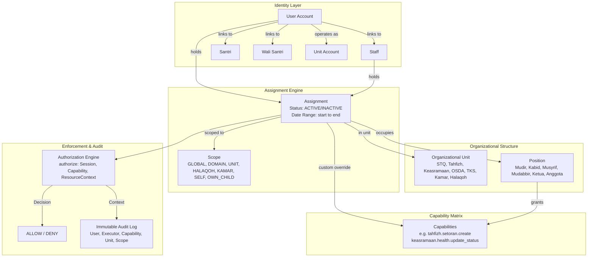

# STQ ARCHITECTURE LOCK — PHASE 1 MASTER SPECIFICATION
**Canonical Identity, Organizational Unit, Assignment, Capability, and Scope Architecture**  
**Repository**: `abdngr23-pixel/stq-education-portal`  
**Baseline Commit**: `4c73317ba8d32924d1e86da2a7f2ef29f6aa0986`  
**Working Branch**: `architecture/stq-lock-phase1`  
**Status**: `READY_FOR_ARCHITECTURE_LOCK_REVIEW`  
**PR #8 Integrity**: Untouched (`HEAD 9068cae5587b7219c394c5c25bf0de07a15b0726`)

---

## 1. Executive Summary & Purpose

The **STQ Architecture Lock** establishes the canonical authorization, identity, and organizational structure for the STQ Education Portal (Pesantren Darul Ulum Cendekia).

Prior to this Lock, the portal evolved through rapid feature increments where authorization was frequently coupled to coarse `Role` enums, ad-hoc boolean flags on staff/user records (e.g., `Staff.isKepalaBidangTahfidz`, `User.isPetugasPresensiPutri`), and implicit assumptions about operational accounts. While hotfixes (PR #10 through PR #13) successfully secured baseline ABAC boundaries and eliminated false health data, the system required a definitive architecture to eliminate:
1. **Role Proliferation**: Attempting to model every operational responsibility (e.g., Mudabbir, OSDA Petugas Kesehatan, Pembina Divisi, Petugas Dapur) as a global `Role` enum.
2. **Ad-hoc Flags**: Adding boolean columns to `User` or `Staff` tables whenever a staff member or student receives a distinct operational role.
3. **Implicit & Person-Name Heuristics**: Relying on person identity, display names, or username patterns instead of verified active organizational assignments.
4. **Coarse Permissions**: Using a single `CRUD` permission matrix that fails to express nuanced boundaries (e.g., read vs create vs update medical records; managerial read vs operational write in tahfizh).

The STQ Architecture Lock defines a comprehensive, deterministic model:
```
IDENTITY  +  ORGANIZATIONAL UNIT  +  POSITION  +  ASSIGNMENT  +  CAPABILITY  +  SCOPE
                                       ↓
                             AUTHORIZATION ENGINE
                                       ↓
                       SERVER-SIDE POLICY ENFORCEMENT
                                       ↓
                        UI DERIVATION & AUDIT LOGGING
```

---

## 2. Non-Negotiable Core Principles

1. **Global Role is a Coarse Identity Category, Not an Organizational Position**:
   - `Role` represents the base technical category of a credential (`STAFF`, `SANTRI`, `WALI`, `UNIT_ACCOUNT`).
   - Functional authorities (e.g. Mudir, Kabid Tahfizh, Musyrif Keasramaan, Mudabbir, Pembina Divisi, Ketua OSDA) are **Positions** held via active **Assignments**, not roles.
2. **Zero Person-Name / Username Heuristics**:
   - A person's name or username must NEVER confer authority.
   - Ust. Razan has supervisory access solely because he holds an active Assignment to `Position: KABID_TAHFIZH` in `Unit: TAHFIZH`.
   - Ustadzah Lisa has halaqoh-scoped access solely because she holds an active Assignment to `Position: MUSYRIF_TAHFIZH` in `Unit: HALAQOH_LISA`.
3. **Server-Side Enforcement is Authoritative**:
   - UI hiding or disabling buttons is an ergonomics layer only.
   - All mutations and queries are enforced fail-closed at the Server Action / API layer.
4. **Principle of Least Privilege (PoLP) & Domain Enclosure**:
   - Institutional READ authority (e.g., Kabid Tahfizh supervision) does NOT automatically grant cross-unit WRITE authority (e.g., Setoran creation).
   - Setoran creation remains enclosed to the musyrif's own halaqoh binaan.
5. **Separation of Personal and Unit Accounts**:
   - Asatidz, Asatidzah, and Santri use individual personal accounts.
   - Operational desks (OSDA divisions, TKS units, poskestren kiosk) may utilize designated unit accounts, but every transaction must attribute both the **Technical Account** and the authenticated **Human Executor**.
6. **Additive, Zero-Downtime Evolution**:
   - No production migrations or breaking schema changes in Phase 1.
   - Compatibility adapters maintain 100% parity with verified production behavior.

---

## 3. Structural Model Overview



---

## 4. Hierarchy of Organizational Units

### 4.1. Institutional Root: STQ Darul Ulum Cendekia
```
STQ Darul Ulum Cendekia (Root)
│
├── 1. Direktorat / Pimpinan (Mudir / Kepala Sekolah)
│
├── 2. Bidang Ketahfidzhan (Tahfizh Domain)
│   ├── Kabid Tahfizh (Supervision & Quality)
│   └── Halaqoh-Halaqoh Qur'an (Unit Halaqoh)
│       ├── Halaqoh Ust. Razan Mufli (Putra)
│       ├── Halaqoh Ust. Zaid (Putra)
│       ├── Halaqoh Ust. Kamal (Putra)
│       ├── Halaqoh Ust. Alwan (Putra)
│       └── Halaqoh Ustadzah Lisa Dwina Fitri (Putri)
│
├── 3. Bidang Keasramaan & Kesantrian (Keasramaan Domain)
│   ├── Kepala Keasramaan / Musyrif Keasramaan
│   │
│   ├── Kamar-Kamar Asrama (Kamar Units)
│   │   ├── Kamar Abu Bakar (Mudabbir A)
│   │   ├── Kamar Umar bin Khattab (Mudabbir A)
│   │   ├── Kamar Utsman bin Affan (Mudabbir B)
│   │   └── Kamar Putri (Mudabbir Putri)
│   │
│   ├── Organisasi Santri Darul Ulum Cendekia (OSDA)
│   │   ├── Pimpinan Harian (Ketua, Sekretaris, Bendahara)
│   │   └── Divisi-Divisi OSDA
│   │       ├── Divisi Keamanan & Kedisiplinan
│   │       ├── Divisi Pendidikan & Ibadah
│   │       ├── Divisi Kebersihan & Kerapihan (Membina Usroh)
│   │       ├── Divisi Kesehatan (Poskestren)
│   │       ├── Divisi Sarana & Prasarana (Sarpras)
│   │       └── Divisi Multimedia
│   │
│   └── Tenaga Kebersihan & Servis (TKS)
│       ├── Unit Dapur & Gizi (Ketua + Anggota)
│       ├── Unit Masjid (Ketua + Anggota)
│       ├── Unit Kantor Pendidikan
│       ├── Unit Kantor Yayasan
│       ├── Unit Air Minum
│       └── Unit Air Sumur
│
├── 4. Bidang Akademik & Kurikulum
│   ├── Guru Akademik (Diniyah & Umum)
│   └── Kelas Akademik (7A, 7B, 8A, 8B)
│
└── 5. Administrasi, Keuangan & Tata Usaha
    ├── Staf Tata Usaha / Admin
    └── Pengelolaan Sponsor / Orang Tua Asuh
```

---

## 5. Summary of Domain Invariants Preserved

| Domain | Entity / Action | Canonical Invariant | Enforcement Mechanism |
| :--- | :--- | :--- | :--- |
| **Tahfizh** | Setoran Creation | Strict Halaqoh Enclosure: Musyrif and Kabid may only create setoran for students in their assigned halaqoh. | `canAccessResource(session, 'tahfizh.setoran.create', { halaqohId: target.halaqohId })` |
| **Tahfizh** | Tasmi'/Sima'an Reward | Authorized solely to Mudir and Kabid Tahfizh. Ordinary MT, ADM, MK, PH strictly rejected. | `hasCapability(session, 'tahfizh.reward.issue')` |
| **Tahfizh** | Reward Policy Edit | Authorized solely to Mudir (`KS`). Kabid and MT denied. | `hasCapability(session, 'tahfizh.policy.manage')` |
| **Tahfizh** | Supervision Recap | Authorized to Mudir, Kabid Tahfizh, and Admin. Ordinary MT sees only own halaqoh. | Scope `GLOBAL` vs `HALAQOH` on `tahfizh.recap.read` |
| **Kesehatan** | Medical Record Read | Global: Mudir, Musyrif Keasramaan, ADM, and assigned OSDA Kesehatan. Scoped: Wali (own child), Santri (self). Ordinary MT denied. | Scope `GLOBAL` vs `OWN_CHILD` / `SELF` on `health.case.read` |
| **Kesehatan** | Status & Referral Update | Authorized to Mudir, Musyrif Keasramaan, and Mudabbir/OSDA Kesehatan with update capability. ADM denied update. | `hasCapability(session, 'health.status.update')` |
| **Kesehatan** | Data Honesty | Zero synthetic "Sehat" fallbacks. Error = "Gagal memuat", Empty = "Belum ada data", Healthy = "Sehat". | `getStatusKesehatanSemantics()` |
| **Keasramaan** | Perizinan Creation | Mudir, Musyrif Keasramaan, and Mudabbir (for assigned kamar). | `hasCapability(session, 'keasramaan.permission.create')` |
| **Keasramaan** | Perizinan Approval | Tier 1: Musyrif Keasramaan. Tier 2 (Pulang): Mudir. | `hasCapability(session, 'keasramaan.permission.approve_mk' / 'approve_ks')` |
| **Keasramaan** | Mudabbir Scope | One Mudabbir may supervise multiple assigned Kamar units. | `assignment.unitId IN (assignedKamarIds)` |
| **Keasramaan** | Pembina Divisi | Reports directly to Musyrif Keasramaan, not under Ketua OSDA. Multiple pembina supported. | `Position: PEMBINA_DIVISI` under `Unit: DIVISI_OSDA` |

---

## 6. Document Map

The STQ Architecture Lock is detailed across 9 specialized specification documents:

1. [`docs/STQ_ARCHITECTURE_LOCK.md`](file:///d:/stq-education-portal-antigravity/stq-education-portal/docs/STQ_ARCHITECTURE_LOCK.md) — Master Architecture Document (This document)
2. [`docs/STQ_AUTHORIZATION_MODEL.md`](file:///d:/stq-education-portal-antigravity/stq-education-portal/docs/STQ_AUTHORIZATION_MODEL.md) — Authorization Engine, Evaluation Algorithms & API Contracts
3. [`docs/STQ_ASSIGNMENT_MODEL.md`](file:///d:/stq-education-portal-antigravity/stq-education-portal/docs/STQ_ASSIGNMENT_MODEL.md) — Organizational Units, Positions, Assignments & Kiosk Accounts
4. [`docs/STQ_CAPABILITY_CATALOG.md`](file:///d:/stq-education-portal-antigravity/stq-education-portal/docs/STQ_CAPABILITY_CATALOG.md) — Exhaustive Catalog of Fine-Grained Capabilities & Naming Rules
5. [`docs/STQ_SCOPE_MODEL.md`](file:///d:/stq-education-portal-antigravity/stq-education-portal/docs/STQ_SCOPE_MODEL.md) — Resource Scopes, Context Binding & Boundaries
6. [`docs/STQ_COMPATIBILITY_MAP.md`](file:///d:/stq-education-portal-antigravity/stq-education-portal/docs/STQ_COMPATIBILITY_MAP.md) — Legacy Role & Flag Mapping to Future Assignments
7. [`docs/STQ_ARCHITECTURE_MIGRATION_PLAN.md`](file:///d:/stq-education-portal-antigravity/stq-education-portal/docs/STQ_ARCHITECTURE_MIGRATION_PLAN.md) — 5-Phase Additive Zero-Downtime Migration Strategy
8. [`docs/STQ_ARCHITECTURE_INVARIANTS.md`](file:///d:/stq-education-portal-antigravity/stq-education-portal/docs/STQ_ARCHITECTURE_INVARIANTS.md) — Comprehensive System Invariants & Non-Regressible Rules
9. [`docs/STQ_ARCHITECTURE_DECISION_LOG.md`](file:///d:/stq-education-portal-antigravity/stq-education-portal/docs/STQ_ARCHITECTURE_DECISION_LOG.md) — Formal Architecture Decision Records (ADR-001 to ADR-008)
