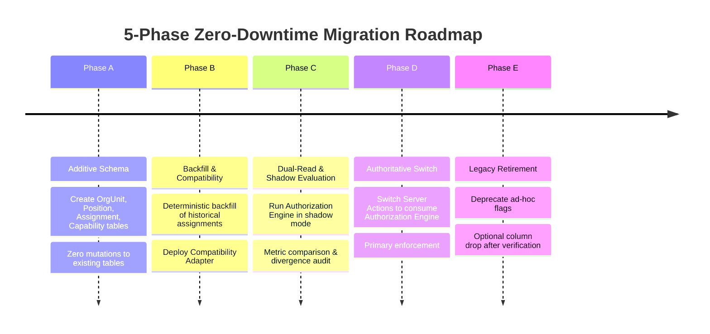

# STQ ARCHITECTURE MIGRATION PLAN — 5-PHASE ZERO-DOWNTIME ROADMAP
**Additive Database Evolution, Shadow Verification, and Legacy Retirement**  
**Document**: `docs/STQ_ARCHITECTURE_MIGRATION_PLAN.md`  
**Status**: `ARCHITECTURE_LOCKED`

---

## 1. Safety Directive & Scope Boundaries

> [!CAUTION]
> **NO PRODUCTION MIGRATION IN PHASE 1**:
> In accordance with strict project instructions, **NO PRODUCTION MIGRATION is executed against the production database during Phase 1**. This document defines the engineering execution blueprint for subsequent phases after independent review and Business Owner approval.

---

## 2. The 5-Phase Migration Framework



---

## 3. Phase Details & Deliverables

### Phase A: Additive Database Schema
- **Objective**: Create new relational structures without altering any existing columns or tables.
- **Candidate Prisma Schema**:
  ```prisma
  model OrgUnit {
    id          String      @id @default(cuid())
    code        String      @unique // e.g. "OU-TAF-001"
    name        String
    type        String      // INSTITUTION, DOMAIN, HALAQOH, KAMAR, DIVISION, WORK_UNIT
    parentId    String?     @map("parent_id")
    parent      OrgUnit?    @relation("OrgUnitHierarchy", fields: [parentId], references: [id])
    children    OrgUnit[]   @relation("OrgUnitHierarchy")
    status      String      @default("ACTIVE")
    assignments Assignment[]
    createdAt   DateTime    @default(now()) @map("created_at")
    updatedAt   DateTime    @updatedAt @map("updated_at")

    @@map("org_units")
  }

  model Position {
    id           String               @id @default(cuid())
    code         String               @unique // e.g. "KABID_TAHFIZH", "MUDABBIR"
    title        String
    domain       String               // TAHFIZH, KEASRAMAAN, AKADEMIK, MANAJEMEN
    capabilities PositionCapability[]
    assignments  Assignment[]
    createdAt    DateTime             @default(now()) @map("created_at")

    @@map("positions")
  }

  model PositionCapability {
    id             String   @id @default(cuid())
    positionId     String   @map("position_id")
    position       Position @relation(fields: [positionId], references: [id], onDelete: Cascade)
    capabilityCode String   @map("capability_code") // e.g. "tahfizh.reward.issue"

    @@unique([positionId, capabilityCode])
    @@map("position_capabilities")
  }

  model Assignment {
    id           String    @id @default(cuid())
    staffId      String?   @map("staff_id")
    staff        Staff?    @relation(fields: [staffId], references: [id])
    userId       String?   @map("user_id")
    user         User?     @relation(fields: [userId], references: [id])
    positionId   String    @map("position_id")
    position     Position  @relation(fields: [positionId], references: [id])
    unitId       String    @map("unit_id")
    unit         OrgUnit   @relation(fields: [unitId], references: [id])
    scopeType    String    @default("UNIT") @map("scope_type") // GLOBAL, DOMAIN, UNIT, HALAQOH, KAMAR
    validFrom    DateTime  @default(now()) @map("valid_from")
    validUntil   DateTime? @map("valid_until")
    status       String    @default("ACTIVE") // ACTIVE, INACTIVE, REVOKED
    notes        String?
    assignedBy   String?   @map("assigned_by")
    createdAt    DateTime  @default(now()) @map("created_at")
    updatedAt    DateTime  @updatedAt @map("updated_at")

    @@index([staffId, status])
    @@index([userId, status])
    @@index([unitId, status])
    @@map("assignments")
  }
  ```
- **Risk Level**: **Zero**. Existing queries and migrations are completely untouched.

---

### Phase B: Backfill & Compatibility Layer
- **Objective**: Deterministically populate units, positions, and baseline assignments from existing production data without interrupting live traffic.
- **Backfill Script Logic**:
  1. Create root `OrgUnit: STQ DUC` and domains (`Tahfizh`, `Keasramaan`, `Akademik`, `Manajemen`).
  2. For each `Halaqoh`, create an `OrgUnit (type: HALAQOH)`.
  3. Create standard `Position` records with their capability templates.
  4. Create `Assignment` for Mudir (`Position: MUDIR`, `Scope: GLOBAL`).
  5. Create `Assignment` for Ust. Razan Mufli (`Position: KABID_TAHFIZH`, `Scope: DOMAIN` + `Position: MUSYRIF_TAHFIZH`, `Unit: Halaqoh Razan`).
  6. Create `Assignment` for Ustadzah Lisa Dwina Fitri (`Position: MUSYRIF_TAHFIZH`, `Unit: Halaqoh Lisa`).
  7. Deploy `CompatibilityAdapter` providing fallback bridges.
- **Rollback Strategy**: If backfill script encounters validation errors, transaction is rolled back; table truncation has zero impact on legacy tables.

---

### Phase C: Dual-Read & Shadow Evaluation
- **Objective**: Verify that the new Authorization Engine computes identical decisions to verified production ABAC without altering request outcomes.
- **Mechanism**:
  - In Server Actions, compute the authorization decision using the legacy guard.
  - Asynchronously invoke `authEngine.authorize(session, capability, context)`.
  - Log any discrepancy to `AuditLog` with action `AUTH_SHADOW_DIVERGENCE`.
  - The live action proceeds based on the verified legacy decision.
- **Success Criteria**: 7 consecutive days of live production traffic with **0 unexpected divergences**.

---

### Phase D: Authoritative Switch on Writes & Enforcement
- **Objective**: Switch the primary authorization enforcement in all Server Actions to `authEngine.authorize()`.
- **Mechanism**:
  - Actions reject requests based on `authEngine` evaluation.
  - Legacy checks act as secondary assertions.
  - Mudabbir accounts and OSDA Petugas Kesehatan assignments are activated.
- **Rollback Strategy**: A feature toggle flag `USE_CANONICAL_AUTH=false` immediately falls back to legacy guards within 100ms.

---

### Phase E: Legacy Retirement & Schema Cleanup
- **Objective**: Safely deprecate redundant columns after 30 days of stable Phase D operation.
- **Target Fields for Deprecation**:
  - `Staff.isKepalaBidangTahfidz` $\implies$ Dropped or marked `@deprecated`.
  - `User.isPetugasPresensiPutri` $\implies$ Dropped or marked `@deprecated`.
- **Database Backup**: Mandatory full pg_dump snapshot taken before executing column retirement.
