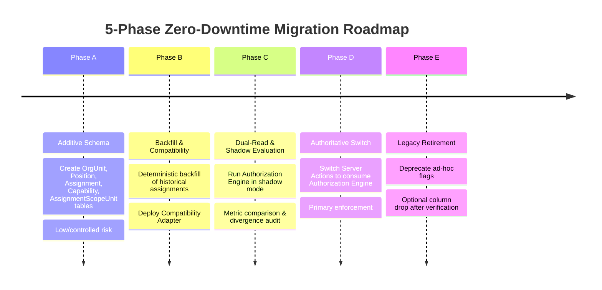

# STQ ARCHITECTURE MIGRATION PLAN — 5-PHASE ZERO-DOWNTIME ROADMAP
**Additive Database Evolution, Shadow Verification, and Legacy Retirement**  
**Document**: `docs/STQ_ARCHITECTURE_MIGRATION_PLAN.md`  
**Status**: `PROPOSED — PENDING BUSINESS OWNER / CHATGPT REVIEW`

---

## 1. Safety Directive & Scope Boundaries

> [!CAUTION]
> **NO PRODUCTION MIGRATION IN PHASE 1**:
> In accordance with strict project instructions, **NO PRODUCTION MIGRATION is executed against the production database during Phase 1**. This document defines the engineering execution blueprint for subsequent phases after independent review and Business Owner approval.

---

## 2. The 5-Phase Migration Framework



---

## 3. Database Enum & Constraint Strategy

To prevent arbitrary strings from entering canonical authorization primitives, the database enforces typed constraints:

```prisma
enum OrgUnitType {
  INSTITUTION
  DOMAIN
  ORGANIZATION
  DIVISION
  HALAQOH
  KAMAR
  SERVICE_UNIT
  USROH
  ACADEMIC_CLASS
}

enum OrgDomain {
  INSTITUTIONAL
  TAHFIZH
  KEASRAMAAN
  AKADEMIK
  MANAJEMEN
}

enum CapabilityNamespace {
  TAHFIZH
  KEASRAMAAN
  HEALTH
  ACADEMIC
  LOGISTICS
  FINANCE
  LETTERS
  SPONSOR
  SYSTEM
}

enum BusinessRuleState {
  VERIFIED_PRODUCTION
  APPROVED_TARGET_PENDING_TECHNICAL
  PROPOSED_TBD
}

enum ScopeType {
  GLOBAL
  DOMAIN
  UNIT
  ASSIGNED_UNITS
  HALAQOH
  KAMAR
  OWN_CHILD
  SELF
}

enum AssignmentStatus {
  DRAFT
  ACTIVE
  SUSPENDED
  EXPIRED
  REVOKED
}

enum AccountType {
  PERSONAL
  UNIT
}

enum GenderComplex {
  PUTRA
  PUTRI
  CAMPUR
  TIDAK_TERIKAT
}
```

*By using native database enums, PostgreSQL strictly rejects invalid pseudo-scopes (such as concatenated domain names or arbitrary strings) at the relational engine layer.*

---

## 4. Phase Details & Candidate Schema

### Phase A: Additive Database Schema & Additive User Column
- **Objective**: Create new relational structures and add the `accountType` column to `User` without destructive alterations.
- **Additive Scope**: Phase A is **ADDITIVE / NON-DESTRUCTIVE**. It introduces new tables and includes an additive column on an existing table (`User.accountType AccountType @default(PERSONAL)`). It does NOT perform breaking schema modifications.
- **Candidate Prisma Schema**:
  ```prisma
  // Additive column on existing User table:
  model User {
    // ... existing columns (id, username, password, role, etc.)
    accountType AccountType @default(PERSONAL) @map("account_type")
    assignments Assignment[]
    unitPlacement UnitAccountPlacement?
    // ... existing relations
  }

  model OrgUnit {
    id             String                 @id @default(cuid())
    code           String                 @unique // e.g. "OU-TAF-001"
    name           String
    type           OrgUnitType
    domain         OrgDomain
    parentId       String?                @map("parent_id")
    parent         OrgUnit?               @relation("OrgUnitHierarchy", fields: [parentId], references: [id], onDelete: Restrict)
    children       OrgUnit[]              @relation("OrgUnitHierarchy")
    genderComplex  GenderComplex          @map("gender_complex")
    isActive       Boolean                @default(true) @map("is_active")
    metadata       Json?                  @map("metadata")
    assignments    Assignment[]
    scopedIn       AssignmentScopeUnit[]
    unitPlacements UnitAccountPlacement[]
    createdAt      DateTime               @default(now()) @map("created_at")
    updatedAt      DateTime               @updatedAt @map("updated_at")

    @@index([domain, type])
    @@index([parentId])
    @@map("org_units")
  }

  model Position {
    id                      String               @id @default(cuid())
    code                    String               @unique // e.g. "KABID_TAHFIZH", "MUDABBIR"
    name                    String
    domain                  OrgDomain
    allowedUnitTypes        OrgUnitType[]        @default([]) @map("allowed_unit_types")
    isLeadership            Boolean              @default(false) @map("is_leadership")
    requiresPersonalAccount Boolean              @default(true) @map("requires_personal_account")
    isActive                Boolean              @default(true) @map("is_active")
    description             String?
    capabilities            PositionCapability[]
    assignments             Assignment[]
    createdAt               DateTime             @default(now()) @map("created_at")
    updatedAt               DateTime             @updatedAt @map("updated_at")

    @@map("positions")
  }

  model UnitAccountPlacement {
    id        String   @id @default(cuid())
    userId    String   @unique @map("user_id")
    user      User     @relation(fields: [userId], references: [id], onDelete: Restrict)
    unitId    String   @map("unit_id")
    unit      OrgUnit  @relation(fields: [unitId], references: [id], onDelete: Restrict)
    createdAt DateTime @default(now()) @map("created_at")
    updatedAt DateTime @updatedAt @map("updated_at")

    @@index([unitId])
    @@map("unit_account_placements")
  }

  model Capability {
    code        String               @id // e.g. "tahfizh.reward.issue"
    namespace   CapabilityNamespace
    name        String
    description String
    isDangerous Boolean              @default(false) @map("is_dangerous")
    positions   PositionCapability[]
    createdAt   DateTime             @default(now()) @map("created_at")

    @@map("capabilities")
  }

  model PositionCapability {
    id                String            @id @default(cuid())
    positionId        String            @map("position_id")
    position          Position          @relation(fields: [positionId], references: [id], onDelete: Restrict)
    capabilityCode    String            @map("capability_code")
    capability        Capability        @relation(fields: [capabilityCode], references: [code], onDelete: Restrict)
    scopeType         ScopeType         @map("scope_type")
    businessRuleState BusinessRuleState @default(PROPOSED_TBD) @map("business_rule_state")

    @@unique([positionId, capabilityCode])
    @@map("position_capabilities")
  }

  model Assignment {
    id          String                @id @default(cuid())
    userId      String                @map("user_id")
    user        User                  @relation(fields: [userId], references: [id], onDelete: Restrict)
    positionId  String                @map("position_id")
    position    Position              @relation(fields: [positionId], references: [id], onDelete: Restrict)
    unitId      String                @map("unit_id")
    unit        OrgUnit               @relation(fields: [unitId], references: [id], onDelete: Restrict)
    status      AssignmentStatus      @default(DRAFT)
    validFrom   DateTime              @default(now()) @map("valid_from")
    validUntil  DateTime?             @map("valid_until")
    notes       String?
    createdById String                @map("created_by_id")
    createdAt   DateTime              @default(now()) @map("created_at")
    updatedAt   DateTime              @updatedAt @map("updated_at")
    scopedUnits AssignmentScopeUnit[]

    @@index([userId, status])
    @@index([unitId, status])
    @@index([positionId, status])
    @@map("assignments")
  }

  model AssignmentScopeUnit {
    id           String     @id @default(cuid())
    assignmentId String     @map("assignment_id")
    assignment   Assignment @relation(fields: [assignmentId], references: [id], onDelete: Cascade)
    unitId       String     @map("unit_id")
    unit         OrgUnit    @relation(fields: [unitId], references: [id], onDelete: Restrict)
    createdAt    DateTime   @default(now()) @map("created_at")

    @@unique([assignmentId, unitId])
    @@map("assignment_scope_units")
  }

  model CanonicalAuditLog {
    id                       String    @id @default(cuid())
    technicalAccountId       String    @map("technical_account_id")
    technicalAccountUsername String    @map("technical_account_username")
    humanExecutorId          String?   @map("human_executor_id")
    humanExecutorName        String?   @map("human_executor_name")
    action                   String
    entity                   String
    entityId                 String?   @map("entity_id")
    capabilityCode           String    @map("capability_code")
    assignmentId             String?   @map("assignment_id")
    positionCode             String    @map("position_code")
    scopeType                ScopeType @map("scope_type")
    unitId                   String    @map("unit_id")
    beforeState              Json?     @map("before_state")
    afterState               Json?     @map("after_state")
    resourceContext          Json?     @map("resource_context")
    reason                   String?
    clientRequestId          String?   @map("client_request_id")
    ipAddress                String?   @map("ip_address")
    userAgent                String?   @map("user_agent")
    createdAt                DateTime  @default(now()) @map("created_at")

    @@index([technicalAccountId])
    @@index([humanExecutorId])
    @@index([action])
    @@index([createdAt])
    @@map("canonical_audit_logs")
  }
  ```

#### Relational Parity & Field Classification (Persisted vs. Computed)

To maintain absolute architectural transparency, every field across runtime TypeScript interfaces and relational Prisma models is strictly classified as either **PERSISTED** (physical database column) or **COMPUTED / RUNTIME-ONLY** (in-memory DTO or derived computation):

| Model / Type | Field Name | Classification | Database Column / Source | Rationale |
|:---|:---|:---|:---|:---|
| `User` | `accountType` | **PERSISTED** | `account_type` (Enum `AccountType`) | Direct relational discriminator on User |
| `OrgUnit` | `id`, `code`, `name`, `type`, `domain`, `parentId`, `genderComplex`, `isActive`, `createdAt`, `updatedAt` | **PERSISTED** | Columns in `org_units` (`genderComplex` is mandatory, NO default; omission cannot silently become CAMPUR) | Core organizational hierarchy |
| `OrgUnit` | `metadata` | **PERSISTED** | `metadata` (`Json?` in `org_units`) | Flexible configuration data |
| `OrgUnit` | `parentUnitId` | **REMOVED** | N/A | Eliminated in favor of single canonical `parentId` |
| `Position` | `id`, `code`, `name`, `domain`, `isLeadership`, `isActive`, `createdAt`, `updatedAt` | **PERSISTED** | Columns in `positions` table | Core functional position template |
| `Position` | `allowedUnitTypes` | **PERSISTED** | `allowed_unit_types` (`OrgUnitType[]`) | Restricts which unit types can anchor this position |
| `Position` | `requiresPersonalAccount` | **PERSISTED** | `requires_personal_account` (`Boolean`) | Enforces PERSONAL account type for sensitive leadership roles |
| `Position` | `description` | **PERSISTED** | `description` (`String?`) | Human-readable role description |
| `UnitAccountPlacement` | `id`, `userId`, `unitId`, `createdAt`, `updatedAt` | **PERSISTED** | Columns in `unit_account_placements` | Strictly enforces single-placement invariant for UNIT accounts |
| `Capability` | `code`, `namespace`, `name`, `description`, `isDangerous`, `createdAt` | **PERSISTED** | Columns in `capabilities` table | Pure semantic action definitions |
| `Capability` | `ruleState` | **REMOVED FROM CAPABILITY** | N/A | Moved to `PositionCapability.businessRuleState` to support multi-state grants |
| `PositionCapability` | `id`, `positionId`, `capabilityCode`, `scopeType`, `businessRuleState` | **PERSISTED** | Columns in `position_capabilities` (`scopeType` is mandatory with NO default; `businessRuleState` defaults fail-closed to `@default(PROPOSED_TBD)`) | Mappings and policy grant lifecycle state |
| `Assignment` | `id`, `userId`, `positionId`, `unitId`, `status`, `validFrom`, `validUntil`, `notes`, `createdById`, `createdAt`, `updatedAt` | **PERSISTED** | Columns in `assignments` (`status` defaults fail-closed to `@default(DRAFT)`; Phase B backfill sets `ACTIVE` explicitly) | Active operational assignment bindings |
| `Assignment` | `scopeType` | **REMOVED** | N/A | Strictly zero-scope on assignment; owned exclusively by `PositionCapability` |
| `AssignmentScopeUnit` | `id`, `assignmentId`, `unitId`, `createdAt` | **PERSISTED** | Columns in `assignment_scope_units` | Relational M:N unit expansion for ASSIGNED_UNITS |
| `CanonicalAuditLog` | All 20 audit attributes | **PERSISTED** | Columns in `canonical_audit_logs` | Immutable forensic snapshot |
| `EffectiveCapabilityGrant` | All fields | **COMPUTED / RUNTIME-ONLY** | Evaluated in-memory by `IAuthorizationEngine` | Dynamic runtime aggregation of active assignments + position capabilities |
| `RequestedResourceContext` | All fields | **COMPUTED / RUNTIME-ONLY** | Untrusted caller input DTO | Memory-only parameter object; strictly rejects authorization relations |
| `ResolvedResourceContext` | All fields | **COMPUTED / RUNTIME-ONLY** | Server-hydrated context DTO | Memory-only evaluated context populated authoritatively by server |
| `AuthorizationResult` | All fields | **COMPUTED / RUNTIME-ONLY** | In-memory evaluation outcome DTO | Return type of `authorize()` |
| `UnitAccountExecutorContext`| All fields | **COMPUTED / RUNTIME-ONLY** | In-memory session execution DTO | Non-repudiation binding for kiosk operations |
- **Risk Level**: **LOW / CONTROLLED**.
  - Operational Considerations: Even additive DDL creates brief metadata locks on PostgreSQL. Migrations will be scheduled during low-traffic maintenance windows.
  - Index creation: Handled transparently during deployment.
  - Prisma client generation: Verified in staging prior to production release.

---

### Phase B: Backfill & Compatibility Layer
- **Objective**: Deterministically populate units, positions, and baseline assignments from existing production data without interrupting live traffic.
- **Grant Lifecycle Backfill Rules (Fail-Closed Enforcement)**:
  - Existing production-compatible grants created during the controlled Phase B backfill MUST specify:
    `businessRuleState = VERIFIED_PRODUCTION` explicitly.
  - Target V2 approved but not yet active grants MUST specify:
    `businessRuleState = APPROVED_TARGET_PENDING_TECHNICAL`.
  - Unapproved or newly mapped grants MUST specify:
    `businessRuleState = PROPOSED_TBD`.
  - Zero automatic promotion: Candidate schema defaults to `@default(PROPOSED_TBD)`. Developer omission while creating a PositionCapability can never result in an authoritative grant.
  - No inferred promotion from Position name, Role, username, or capability name.
- **The Explicit Activation Triple (Phase A/B Authorization Guarantee)**:
  For any effective authority to exist during Phase A/B, all three security dimensions must be deliberate:
  1. **Assignment**: `status = ACTIVE` (explicitly set for active operational staff; candidate schema defaults fail-closed to `@default(DRAFT)`).
  2. **PositionCapability**: `businessRuleState = VERIFIED_PRODUCTION` (explicitly set; candidate schema defaults fail-closed to `@default(PROPOSED_TBD)`).
  3. **PositionCapability**: `scopeType` explicitly declared (mandatory, NO default; never inferred from anchor unit).
  *Plus*: Target resource context must match the explicit scope and `genderComplex` boundary.
  *If any required dimension is missing, unapproved, or invalid: DENY / FAIL CLOSED.*
- **Backfill Script Logic**:
  1. Create root `OrgUnit: STQ DUC` and domains (`Tahfizh`, `Keasramaan`, `Akademik`, `Manajemen`).
  2. For each authoritative `Halaqoh` in database, create an `OrgUnit (type: HALAQOH)`.
  3. For each room in authoritative dormitory structure, create an `OrgUnit (type: KAMAR)`.
  4. Create standard `Position` records with their capability templates and scopes.
  5. Create `Assignment` for Mudir (`Position: MUDIR`).
  6. [Illustrative Example] Create `Assignment` for staff holding Kabid Tahfizh (`Position: KABID_TAHFIZH`) and Musyrif (`Position: MUSYRIF_TAHFIZH`, assigned halaqoh).
  7. [Illustrative Example] Create `Assignment` for female Musyrif Tahfizh in assigned halaqoh.
  8. Deploy `CompatibilityAdapter` providing fallback bridges.
- **Rollback Strategy**: If backfill script encounters validation errors, the transaction is rolled back; table truncation has zero impact on legacy tables.

---

### Phase C: Dual-Read & Shadow Evaluation
- **Objective**: Verify that the new Authorization Engine computes identical decisions to verified production ABAC without altering request outcomes.
- **Mechanism**:
  - In Server Actions, compute the authorization decision using the legacy guard.
  - Asynchronously invoke `authEngine.authorize(session, capability, context)`.
  - Log any discrepancy to `AuditLog` with action `AUTH_SHADOW_DIVERGENCE`.
  - The live action proceeds based on the verified legacy decision.
- **Success Criteria**: 7 consecutive days of live production traffic with **0 unexpected divergences**.

---

### Phase D: Authoritative Switch on Writes & Enforcement
- **Objective**: Switch the primary authorization enforcement in all Server Actions to `authEngine.authorize()`.
- **Mechanism**:
  - Actions reject requests based on `authEngine` evaluation.
  - Legacy checks act as secondary assertions.
  - Mudabbir accounts and OSDA Petugas Kesehatan assignments are activated.
- **Rollback Strategy**: A feature toggle flag `USE_CANONICAL_AUTH=false` provides an immediate zero-deployment rollback path to verified legacy guards.

---

### Phase E: Legacy Retirement & Schema Cleanup
- **Objective**: Safely deprecate redundant columns after 30 days of stable Phase D operation.
- **Target Fields for Deprecation**:
  - `Staff.isKepalaBidangTahfidz` $\implies$ Marked `@deprecated` then dropped in major cleanup.
  - `User.isPetugasPresensiPutri` $\implies$ Marked `@deprecated` then dropped in major cleanup.
- **Database Backup**: Mandatory full pg_dump snapshot taken before executing column retirement.
