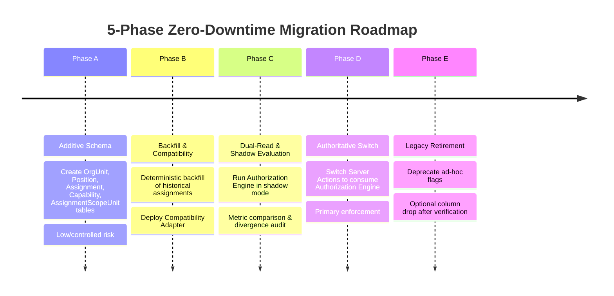

# STQ ARCHITECTURE MIGRATION PLAN — 5-PHASE ZERO-DOWNTIME ROADMAP
**Additive Database Evolution, Shadow Verification, and Legacy Retirement**  
**Document**: `docs/STQ_ARCHITECTURE_MIGRATION_PLAN.md`  
**Status**: `PROPOSED — PENDING BUSINESS OWNER / CHATGPT REVIEW`

---

## 1. Safety Directive & Scope Boundaries

> [!CAUTION]
> **NO PRODUCTION MIGRATION IN PHASE 1**:
> In accordance with strict project instructions, **NO PRODUCTION MIGRATION is executed against the production database during Phase 1**. This document defines the engineering execution blueprint for subsequent phases after independent review and Business Owner approval.

---

## 2. The 5-Phase Migration Framework



---

## 3. Database Enum & Constraint Strategy

To prevent arbitrary strings from entering canonical authorization primitives, the database enforces typed constraints:

```prisma
enum OrgUnitType {
  INSTITUTION
  DOMAIN
  ORGANIZATION
  DIVISION
  HALAQOH
  KAMAR
  SERVICE_UNIT
  USROH
  ACADEMIC_CLASS
}

enum STQDomain {
  INSTITUTIONAL
  TAHFIZH
  KEASRAMAAN
  KESEHATAN
  AKADEMIK
  MANAJEMEN
  LOGISTIK
  SISTEM
}

enum ScopeType {
  GLOBAL
  DOMAIN
  UNIT
  ASSIGNED_UNITS
  HALAQOH
  KAMAR
  OWN_CHILD
  SELF
}

enum AssignmentStatus {
  DRAFT
  ACTIVE
  SUSPENDED
  EXPIRED
  REVOKED
}

enum AccountType {
  PERSONAL
  UNIT
}

enum GenderComplex {
  PUTRA
  PUTRI
  CAMPUR
  TIDAK_TERIKAT
}
```

*By using native database enums, PostgreSQL strictly rejects invalid pseudo-scopes (such as concatenated domain names or arbitrary strings) at the relational engine layer.*

---

## 4. Phase Details & Candidate Schema

### Phase A: Additive Database Schema
- **Objective**: Create new relational structures without altering any existing columns or tables.
- **Candidate Prisma Schema**:
  ```prisma
  model OrgUnit {
    id            String                @id @default(cuid())
    code          String                @unique // e.g. "OU-TAF-001"
    name          String
    type          OrgUnitType
    domain        STQDomain
    parentId      String?               @map("parent_id")
    parent        OrgUnit?              @relation("OrgUnitHierarchy", fields: [parentId], references: [id], onDelete: Restrict)
    children      OrgUnit[]             @relation("OrgUnitHierarchy")
    genderComplex GenderComplex         @default(CAMPUR) @map("gender_complex")
    isActive      Boolean               @default(true) @map("is_active")
    assignments   Assignment[]
    scopedIn      AssignmentScopeUnit[]
    createdAt     DateTime              @default(now()) @map("created_at")
    updatedAt     DateTime              @updatedAt @map("updated_at")

    @@index([domain, type])
    @@index([parentId])
    @@map("org_units")
  }

  model Position {
    id           String               @id @default(cuid())
    code         String               @unique // e.g. "KABID_TAHFIZH", "MUDABBIR"
    name         String
    domain       STQDomain
    isLeadership Boolean              @default(false) @map("is_leadership")
    isActive     Boolean              @default(true) @map("is_active")
    capabilities PositionCapability[]
    assignments  Assignment[]
    createdAt    DateTime             @default(now()) @map("created_at")
    updatedAt    DateTime             @updatedAt @map("updated_at")

    @@map("positions")
  }

  model Capability {
    code        String               @id // e.g. "tahfizh.reward.issue"
    domain      STQDomain
    name        String
    description String
    isDangerous Boolean              @default(false) @map("is_dangerous")
    positions   PositionCapability[]
    createdAt   DateTime             @default(now()) @map("created_at")

    @@map("capabilities")
  }

  model PositionCapability {
    id             String     @id @default(cuid())
    positionId     String     @map("position_id")
    position       Position   @relation(fields: [positionId], references: [id], onDelete: Restrict)
    capabilityCode String     @map("capability_code")
    capability     Capability @relation(fields: [capabilityCode], references: [code], onDelete: Restrict)
    scopeType      ScopeType  @default(UNIT) @map("scope_type")

    @@unique([positionId, capabilityCode])
    @@map("position_capabilities")
  }

  model Assignment {
    id          String                @id @default(cuid())
    userId      String                @map("user_id")
    user        User                  @relation(fields: [userId], references: [id], onDelete: Restrict)
    positionId  String                @map("position_id")
    position    Position              @relation(fields: [positionId], references: [id], onDelete: Restrict)
    unitId      String                @map("unit_id")
    unit        OrgUnit               @relation(fields: [unitId], references: [id], onDelete: Restrict)
    scopeType   ScopeType             @default(UNIT) @map("scope_type")
    status      AssignmentStatus      @default(ACTIVE)
    validFrom   DateTime              @default(now()) @map("valid_from")
    validUntil  DateTime?             @map("valid_until")
    notes       String?
    createdById String                @map("created_by_id")
    createdAt   DateTime              @default(now()) @map("created_at")
    updatedAt   DateTime              @updatedAt @map("updated_at")
    scopedUnits AssignmentScopeUnit[]

    @@index([userId, status])
    @@index([unitId, status])
    @@index([positionId, status])
    @@map("assignments")
  }

  model AssignmentScopeUnit {
    id           String     @id @default(cuid())
    assignmentId String     @map("assignment_id")
    assignment   Assignment @relation(fields: [assignmentId], references: [id], onDelete: Cascade)
    unitId       String     @map("unit_id")
    unit         OrgUnit    @relation(fields: [unitId], references: [id], onDelete: Restrict)
    createdAt    DateTime   @default(now()) @map("created_at")

    @@unique([assignmentId, unitId])
    @@map("assignment_scope_units")
  }

  model CanonicalAuditLog {
    id                       String    @id @default(cuid())
    technicalAccountId       String    @map("technical_account_id")
    technicalAccountUsername String    @map("technical_account_username")
    humanExecutorId          String?   @map("human_executor_id")
    humanExecutorName        String?   @map("human_executor_name")
    action                   String
    entity                   String
    entityId                 String?   @map("entity_id")
    capabilityCode           String    @map("capability_code")
    assignmentId             String?   @map("assignment_id")
    positionCode             String    @map("position_code")
    scopeType                ScopeType @map("scope_type")
    unitId                   String    @map("unit_id")
    beforeState              Json?     @map("before_state")
    afterState               Json?     @map("after_state")
    resourceContext          Json?     @map("resource_context")
    reason                   String?
    clientRequestId          String?   @map("client_request_id")
    ipAddress                String?   @map("ip_address")
    userAgent                String?   @map("user_agent")
    createdAt                DateTime  @default(now()) @map("created_at")

    @@index([technicalAccountId])
    @@index([humanExecutorId])
    @@index([action])
    @@index([createdAt])
    @@map("canonical_audit_logs")
  }
  ```
- **Risk Level**: **LOW / CONTROLLED**.
  - Operational Considerations: Even additive DDL creates brief metadata locks on PostgreSQL. Migrations will be scheduled during low-traffic maintenance windows.
  - Index creation: Handled transparently during deployment.
  - Prisma client generation: Verified in staging prior to production release.

---

### Phase B: Backfill & Compatibility Layer
- **Objective**: Deterministically populate units, positions, and baseline assignments from existing production data without interrupting live traffic.
- **Backfill Script Logic**:
  1. Create root `OrgUnit: STQ DUC` and domains (`Tahfizh`, `Keasramaan`, `Akademik`, `Manajemen`).
  2. For each `Halaqoh`, create an `OrgUnit (type: HALAQOH)`.
  3. Create standard `Position` records with their capability templates.
  4. Create `Assignment` for Mudir (`Position: MUDIR`, `Scope: GLOBAL`).
  5. Create `Assignment` for Ust. Razan Mufli (`Position: KABID_TAHFIZH`, `Scope: DOMAIN` + `Position: MUSYRIF_TAHFIZH`, `Unit: Halaqoh Razan`).
  6. Create `Assignment` for Ustadzah Lisa Dwina Fitri (`Position: MUSYRIF_TAHFIZH`, `Unit: Halaqoh Lisa`).
  7. Deploy `CompatibilityAdapter` providing fallback bridges.
- **Rollback Strategy**: If backfill script encounters validation errors, the transaction is rolled back; table truncation has zero impact on legacy tables.

---

### Phase C: Dual-Read & Shadow Evaluation
- **Objective**: Verify that the new Authorization Engine computes identical decisions to verified production ABAC without altering request outcomes.
- **Mechanism**:
  - In Server Actions, compute the authorization decision using the legacy guard.
  - Asynchronously invoke `authEngine.authorize(session, capability, context)`.
  - Log any discrepancy to `AuditLog` with action `AUTH_SHADOW_DIVERGENCE`.
  - The live action proceeds based on the verified legacy decision.
- **Success Criteria**: 7 consecutive days of live production traffic with **0 unexpected divergences**.

---

### Phase D: Authoritative Switch on Writes & Enforcement
- **Objective**: Switch the primary authorization enforcement in all Server Actions to `authEngine.authorize()`.
- **Mechanism**:
  - Actions reject requests based on `authEngine` evaluation.
  - Legacy checks act as secondary assertions.
  - Mudabbir accounts and OSDA Petugas Kesehatan assignments are activated.
- **Rollback Strategy**: A feature toggle flag `USE_CANONICAL_AUTH=false` provides an immediate zero-deployment rollback path to verified legacy guards.

---

### Phase E: Legacy Retirement & Schema Cleanup
- **Objective**: Safely deprecate redundant columns after 30 days of stable Phase D operation.
- **Target Fields for Deprecation**:
  - `Staff.isKepalaBidangTahfidz` $\implies$ Marked `@deprecated` then dropped in major cleanup.
  - `User.isPetugasPresensiPutri` $\implies$ Marked `@deprecated` then dropped in major cleanup.
- **Database Backup**: Mandatory full pg_dump snapshot taken before executing column retirement.
