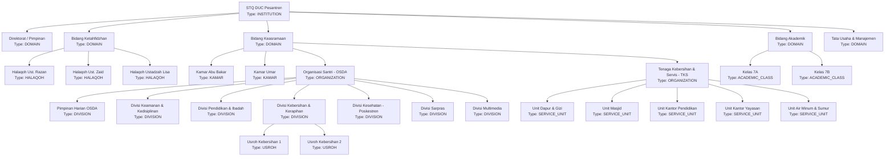
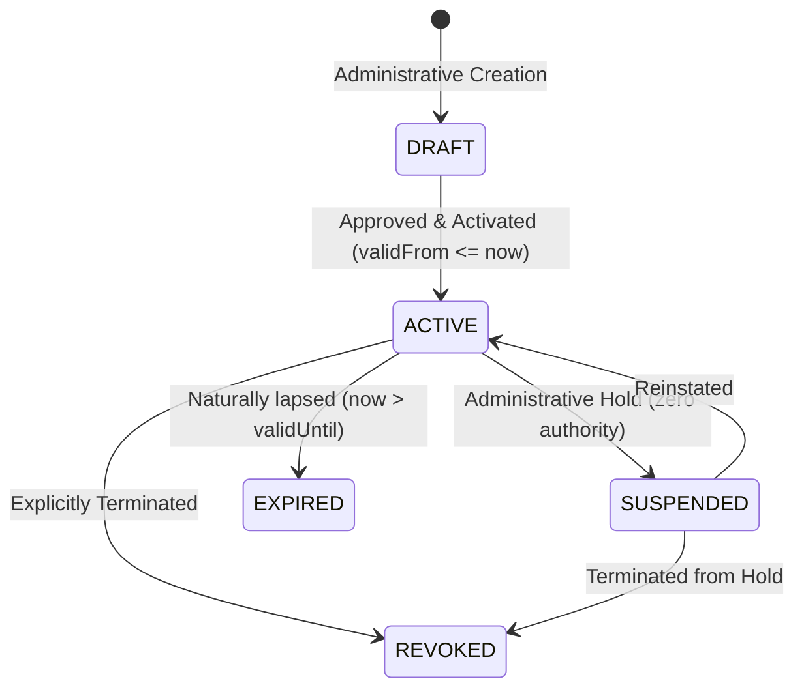

# STQ ASSIGNMENT MODEL — ORGANIZATIONAL UNITS & POSITIONS
**Organizational Hierarchy, Multi-Assignment Architecture, and Account Models**  
**Document**: `docs/STQ_ASSIGNMENT_MODEL.md`  
**Status**: `PROPOSED — PENDING BUSINESS OWNER / CHATGPT REVIEW`

---

## 1. Core Organizational Concepts

The STQ organizational architecture decouples **Identity** (who a person is) from **Functional Authority** (what an account is authorized to do). It consists of three foundational models:

1. **Organizational Unit (`OrgUnit`)**:
   A structural department, division, halaqoh, kamar, service unit, or academic class in the pesantren.
2. **Position (`Position`)**:
   A defined functional role or title within an organizational unit (e.g., Mudir, Kabid, Musyrif, Mudabbir, Ketua, Anggota).
3. **Assignment (`Assignment`)**:
   The active, time-bounded linkage binding an authenticated **User Identity** to a **Position** inside an **Organizational Unit** with an explicit **Scope**.

---

## 2. Canonical Organizational Unit Tree & Categories



### Canonical Unit Types Definition
The system recognizes exactly ONE normalized `OrgUnitType` vocabulary:
- `INSTITUTION`: Root pesantren entity (STQ Darul Ulum Cendekia).
- `DOMAIN`: Strategic organizational domain (Tahfizh, Keasramaan, Akademik, Manajemen).
- `ORGANIZATION`: Structured overarching bodies (OSDA, TKS).
- `DIVISION`: Functional wings within an organization (Keamanan, Ibadah, Poskestren, dll.).
- `HALAQOH`: Qur'anic study circle grouping students under an assigned musyrif.
- `KAMAR`: Dormitory room grouping students under an assigned Mudabbir.
- `SERVICE_UNIT`: Operational service desk under TKS (Dapur, Masjid, Air). Dedicated to institutional technical service units.
- `USROH`: Small student taskforce (e.g. daily cleaning rotation under OSDA Kebersihan).
- `ACADEMIC_CLASS`: Academic instructional classroom (Kelas 7A, 7B, 8A, 8B).

---

## 3. Position & Capability-Scope Mapping

A **Position** defines an institutional responsibility and capability template. Rather than assuming uniform scope across all capabilities, scope is modeled per capability on `PositionCapability`:

$$\text{PositionCapability} = (\text{positionId}, \text{capabilityCode}, \text{scopeType})$$

This models real-world positions without duplicating records or inventing ad-hoc logic:
- `Position: KABID_TAHFIZH`:
  - `tahfizh.recap.read` $\implies$ Scope: `DOMAIN`
  - `tahfizh.reward.issue` $\implies$ Scope: `DOMAIN`
- `Position: MUSYRIF_TAHFIZH`:
  - `tahfizh.setoran.create` $\implies$ Scope: `HALAQOH`
  - `tahfizh.recap.read` $\implies$ Scope: `HALAQOH`

```prisma
model PositionCapability {
  id             String     @id @default(cuid())
  positionId     String     @map("position_id")
  position       Position   @relation(fields: [positionId], references: [id], onDelete: Restrict)
  capabilityCode String     @map("capability_code")
  capability     Capability @relation(fields: [capabilityCode], references: [code], onDelete: Restrict)
  scopeType      String     @default("UNIT") @map("scope_type") // GLOBAL, DOMAIN, UNIT, HALAQOH, KAMAR

  @@unique([positionId, capabilityCode])
  @@map("position_capabilities")
}
```

---

## 4. Assignment Subject Integrity & Relational Scope Binding

### 4.1. Deterministic Subject Model
An `Assignment` belongs to a `User` as the technical authentication principal (`userId: String`, non-nullable):
- **Personal Staff Assignment**: `Assignment.userId` connects to `User`, whose `user.staffId` resolves the verified `Staff` educator profile.
- **Santri Assignment**: `Assignment.userId` connects to `User`, whose `user.santriId` resolves the enrolled student record.
- **Unit Account Assignment**: `Assignment.userId` connects to a dedicated kiosk `User` (`AccountType: UNIT`), assigned to exactly one operational unit.
- **Wali Authority**: Derived relationally from the guardian's verified children (`guardianLinkedSantriIds`).

### 4.2. Relational Multi-Unit Scope Binding (`AssignmentScopeUnit`)
To eliminate non-relational string arrays without FK integrity, multi-unit responsibilities (e.g. a Mudabbir supervising multiple kamar) are modeled relationally:

```prisma
model Assignment {
  id          String                @id @default(cuid())
  userId      String                @map("user_id")
  user        User                  @relation(fields: [userId], references: [id], onDelete: Restrict)
  positionId  String                @map("position_id")
  position    Position              @relation(fields: [positionId], references: [id], onDelete: Restrict)
  unitId      String                @map("unit_id")
  unit        OrgUnit               @relation(fields: [unitId], references: [id], onDelete: Restrict)
  scopeType   String                @default("UNIT") @map("scope_type")
  status      String                @default("ACTIVE") // DRAFT, ACTIVE, SUSPENDED, EXPIRED, REVOKED
  validFrom   DateTime              @default(now()) @map("valid_from")
  validUntil  DateTime?             @map("valid_until")
  notes       String?
  createdById String                @map("created_by_id")
  createdAt   DateTime              @default(now()) @map("created_at")
  updatedAt   DateTime              @updatedAt @map("updated_at")
  scopedUnits AssignmentScopeUnit[]

  @@index([userId, status])
  @@index([unitId, status])
  @@index([positionId, status])
  @@map("assignments")
}

model AssignmentScopeUnit {
  id           String     @id @default(cuid())
  assignmentId String     @map("assignment_id")
  assignment   Assignment @relation(fields: [assignmentId], references: [id], onDelete: Cascade)
  unitId       String     @map("unit_id")
  unit         OrgUnit    @relation(fields: [unitId], references: [id], onDelete: Restrict)
  createdAt    DateTime   @default(now()) @map("created_at")

  @@unique([assignmentId, unitId])
  @@map("assignment_scope_units")
}
```

---

## 5. Account Modalities: Personal vs. Unit Accounts

### 5.1. Personal Accounts (`AccountType: PERSONAL`)
- Used by: Asatidz, Mudabbir, Staf TU, Santri, Wali Santri.
- Authentication: Individual credentials with personal session JWT.
- Accountability: The `userId` in `AuditLog` directly identifies the human actor.

### 5.2. Unit Accounts (`AccountType: UNIT`)
- Used by: Poskestren UKS desk, OSDA division tablets, TKS Dapur workstation.
- Placement: A unit account belongs to **exactly one** operational unit.
- Non-Repudiation Rule:
  - Free-text display name alone does **NOT** provide non-repudiation.
  - Submitting any mutating transaction requires explicit identification of the **Human Executor** (`humanExecutorId`), verified against active `Staff` or `Santri` records in the database.
  - The resulting audit record permanently captures both:
    ```json
    {
      "technicalAccountId": "usr-kiosk-poskestren",
      "technicalAccountUsername": "kiosk.poskestren",
      "humanExecutorId": "san-0012-ahmad",
      "humanExecutorName": "Ahmad Fauzi (OSDA Kesehatan)",
      "action": "health.case.create",
      "timestamp": "2026-09-17T09:30:00.000Z"
    }
    ```

---

## 6. Canonical Assignment Lifecycle & Historical Integrity



- **Semantics**:
  - `DRAFT`: Proposed assignment, not yet authoritative.
  - `ACTIVE`: Currently authoritative. **Only ACTIVE assignments within `validFrom <= now <= validUntil` grant capabilities.**
  - `SUSPENDED`: Temporarily grants zero authority (e.g. during formal inquiry or temporary absence).
  - `EXPIRED`: Naturally lapsed upon reaching `validUntil`.
  - `REVOKED`: Explicitly terminated administratively before natural expiry.
- **Historical Integrity**:
  - Assignments are **NEVER hard-deleted**.
  - Foreign key delete behavior uses `RESTRICT` on `Position` and `OrgUnit`.
  - Audits snapshot the exact `positionCode`, `capabilityCode`, `unitId`, and `scopeType` at the moment of execution. Subsequent assignment deactivations have zero effect on past audit validity.
