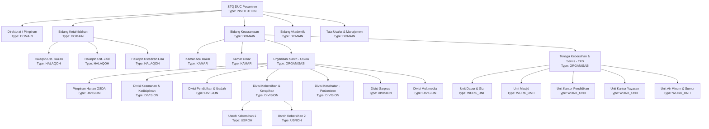

# STQ ASSIGNMENT MODEL — ORGANIZATIONAL UNITS & POSITIONS
**Organizational Hierarchy, Multi-Assignment Architecture, and Account Models**  
**Document**: `docs/STQ_ASSIGNMENT_MODEL.md`  
**Status**: `ARCHITECTURE_LOCKED`

---

## 1. Core Organizational Concepts

The STQ organizational architecture decouples **Identity** (who a person is) from **Functional Authority** (what a person is currently assigned to do). It consists of three foundational models:

1. **Organizational Unit (`OrgUnit`)**:
   A structural department, division, work unit, halaqoh, or room in the pesantren.
2. **Position (`Position`)**:
   A defined functional role or title within an organizational unit (e.g., Mudir, Kabid, Musyrif, Mudabbir, Ketua, Anggota).
3. **Assignment (`Assignment`)**:
   The active, time-bounded linkage binding an **Identity** (`Staff` or `User`) to a **Position** inside an **Organizational Unit** with an explicit **Scope**.

---

## 2. Organizational Unit Tree & Categories



### Unit Types Definition
- `INSTITUTION`: Root pesantren entity.
- `DOMAIN`: Strategic division (Tahfizh, Keasramaan, Akademik, Manajemen).
- `HALAQOH`: Qur'anic study circle grouping 5 to 15 students under an assigned musyrif.
- `KAMAR`: Dormitory room grouping students under an assigned Mudabbir.
- `ORGANISASI`: Structured body (OSDA, TKS).
- `DIVISION`: Functional wing within an organization.
- `WORK_UNIT`: Operational service unit.
- `USROH`: Small student taskforce (e.g. daily cleaning rotation).

---

## 3. Position Definitions

A **Position** defines an institutional responsibility and serves as a capability template. Positions are domain-specific and reusable across units:

| Position Code | Title | Target OrgUnit Type | Default Scope | Key Capabilities |
| :--- | :--- | :--- | :--- | :--- |
| `MUDIR` | Kepala Sekolah / Mudir | `INSTITUTION` / `DOMAIN` | `GLOBAL` | Full executive approval, reward policy, tier 2 perizinan. |
| `KABID_TAHFIZH` | Kepala Bidang Tahfidz | `DOMAIN` (Tahfizh) | `DOMAIN` | Institutional Tahfizh supervisory recap, Tasmi/Sima'an reward. |
| `MUSYRIF_TAHFIZH` | Musyrif Tahfizh | `HALAQOH` | `HALAQOH` | Setoran creation, halaqoh student monitoring, mutaba'ah. |
| `KEPALA_KEASRAMAAN` | Musyrif Keasramaan | `DOMAIN` (Keasramaan) | `DOMAIN` | Global health oversight, discipline, tier 1 perizinan approval. |
| `MUDABBIR` | Pembina Kamar | `KAMAR` | `ASSIGNED_UNITS` | Room inspection, attendance, initial perizinan request, health referral. |
| `PEMBINA_DIVISI` | Pembina Divisi OSDA | `DIVISION` | `UNIT` | Supervisory oversight of designated OSDA division. |
| `KETUA_OSDA` | Ketua OSDA | `ORGANISASI` (OSDA) | `UNIT` | General OSDA operational coordination. |
| `PETUGAS_KESEHATAN` | Petugas Poskestren | `DIVISION` (Kesehatan) | `GLOBAL` (Health) | Initial medical intake, recording health complaints. |
| `PETUGAS_PRESENSI` | Petugas Presensi | `KAMAR` / `UNIT` | `UNIT` | Recording daily prayer and assembly attendance. |
| `OPERATOR_TKS` | Operator Unit TKS | `WORK_UNIT` (TKS) | `UNIT` | Operational log entry (dapur, masjid, maintenance). |

> [!IMPORTANT]
> **No Global Role Enum for Positions**: None of the positions above require an entry in the PostgreSQL `enum Role`. They exist as records in the `Position` table.

---

## 4. Multi-Assignment Support

The canonical model explicitly supports many-to-many relationships:
1. **One Person with Multiple Assignments**:
   - Ust. Razan Mufli holds:
     - `Assignment 1`: `Position: KABID_TAHFIZH` in `Unit: BIDANG_TAHFIZH` (Scope: `DOMAIN`)
     - `Assignment 2`: `Position: MUSYRIF_TAHFIZH` in `Unit: HALAQOH_RAZAN` (Scope: `HALAQOH`)
   - An Ustadz may serve as `GURU_AKADEMIK` in the morning and `PEMBINA_DIVISI_KEAMANAN` in the evening.
2. **One Mudabbir Responsible for Multiple Kamar**:
   - Mudabbir Ahmad holds assignments to both `Unit: KAMAR_ABU_BAKAR` and `Unit: KAMAR_UMAR`.
   - His effective operational scope automatically encompasses all students residing in either room.
3. **Multiple Pembina Divisi for One Division**:
   - `Divisi Keamanan` can have two Asatidz assigned simultaneously as `PEMBINA_DIVISI`.
   - Both hold supervisory capabilities over that division's records.

---

## 5. Account Models: Personal vs. Unit Accounts

To support operational reality without compromising security, the architecture differentiates two operational account modalities:

### 5.1. Personal Accounts
- Used by: Asatidz, Mudabbir, Staf TU, Santri, Wali Santri.
- Authentication: Standard individual credentials (username/email + secure password / WebAuthn).
- Accountability: The `userId` in `AuditLog` directly identifies the individual person.

### 5.2. Unit / Operational Desk Accounts
- Used by: Poskestren UKS desk, OSDA division desks, TKS Dapur tablet.
- Purpose: Prevent device login churn when multiple students or operators take turns on shift at a physical kiosk.
- Operational Contract:
  - Account credential represents the **Unit Account** (e.g. `kiosk.poskestren`, `kiosk.dapur`).
  - Upon submitting a transactional mutation (e.g. Recording sick student, logging meal distribution), the UI enforces entering or selecting the **Human Executor Identity** (`executorStaffId` or `executorSantriId` + PIN/passcode).
  - The resulting `AuditLog` immutably captures both:
    ```json
    {
      "technicalUserId": "usr-kiosk-poskestren",
      "executorId": "san-0012-ahmad",
      "executorName": "Ahmad Fauzi (OSDA Kesehatan)",
      "action": "CATAT_KESEHATAN",
      "timestamp": "2026-09-17T08:55:00.000Z"
    }
    ```
  - This preserves non-repudiation and forensic integrity.

---

## 6. Assignment Lifecycle & Historical Integrity

- Assignments are **NEVER hard-deleted**.
- Lifecycle transitions:
  $$\text{DRAFT} \longrightarrow \text{ACTIVE} \longrightarrow \text{EXPIRED} \mid \text{REVOKED}$$
- Deactivating an assignment sets `status = 'INACTIVE'` and `validUntil = now()`.
- Historical audit records reference the `assignmentId` that was valid at the exact timestamp of execution. Even if an assignment is subsequently revoked, past audit records remain immutable and mathematically verifiable.
