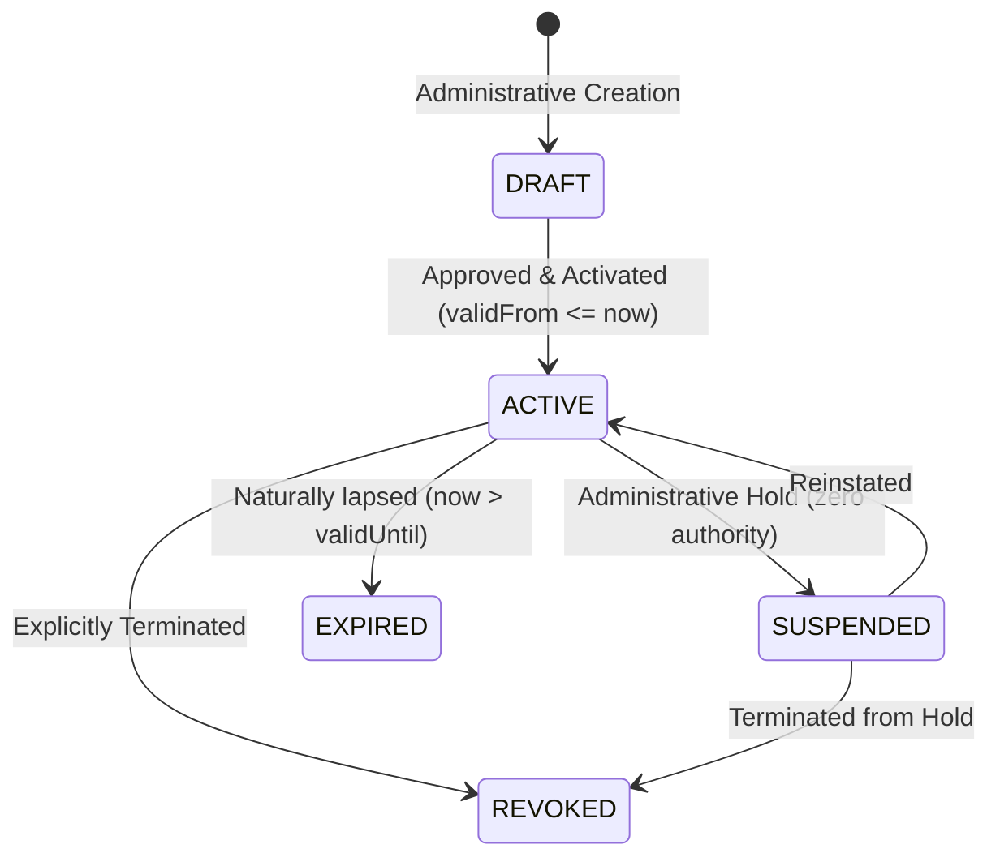

# STQ ASSIGNMENT MODEL — ORGANIZATIONAL UNITS & POSITIONS
**Organizational Hierarchy, Multi-Assignment Architecture, and Account Models**  
**Document**: `docs/STQ_ASSIGNMENT_MODEL.md`  
**Status**: `PROPOSED — PENDING BUSINESS OWNER / CHATGPT REVIEW`

---

## 1. Core Organizational Concepts

The STQ organizational architecture decouples **Identity** (who a person is) from **Functional Authority** (what an account is authorized to do). It consists of three foundational models:

1. **Organizational Unit (`OrgUnit`)**:
   A structural department, division, halaqoh, kamar, service unit, or academic class in the pesantren. Domain is strictly `OrgDomain` (`INSTITUTIONAL`, `TAHFIZH`, `KEASRAMAAN`, `AKADEMIK`, `MANAJEMEN`).
2. **Position (`Position`)**:
   A defined functional template within an organizational unit (e.g., Mudir, Kabid, Musyrif, Mudabbir, Ketua, Anggota).
3. **Assignment (`Assignment`)**:
   The active, time-bounded linkage binding an authenticated **User Identity** to a **Position** inside an **Organizational Unit**. The assignment contains an anchor `unitId` and lifecycle timestamps, but **NO** `scopeType`. `PositionCapability.scopeType` is the single source of truth for scope.

---

## 2. Canonical Organizational Unit Tree & Categories

```mermaid
graph TD
    ROOT[STQ DUC Pesantren<br/>Type: INSTITUTION]
    
    ROOT --> D_DIR[Direktorat / Pimpinan<br/>Domain: INSTITUTIONAL]
    ROOT --> D_TAF[Bidang Ketahfidzhan<br/>Domain: TAHFIZH]
    ROOT --> D_KSR[Bidang Keasramaan<br/>Domain: KEASRAMAAN]
    ROOT --> D_AKD[Bidang Akademik<br/>Domain: AKADEMIK]
    ROOT --> D_ADM[Tata Usaha & Manajemen<br/>Domain: MANAJEMEN]

    D_TAF --> HLQ1["Halaqoh Qur'an Banin (Illustrative)<br/>Type: HALAQOH"]
    D_TAF --> HLQ2["Halaqoh Qur'an Banat (Illustrative)<br/>Type: HALAQOH"]

    D_KSR --> KMR_A["Kamar Asrama Banin (Illustrative)<br/>Type: KAMAR"]
    D_KSR --> KMR_B["Kamar Asrama Banat (Illustrative)<br/>Type: KAMAR"]
    D_KSR --> OSDA["Organisasi Santri Darul Ulum Cendekia - OSDA<br/>Type: ORGANIZATION"]
    D_KSR --> TKS["Tugas Khusus Santri - TKS<br/>Type: ORGANIZATION"]

    OSDA --> OS_PI["Pengurus Inti OSDA<br/>(Ketua, Sekretaris, Bendahara, Multimedia)"]
    OSDA --> OS_KMN["Divisi Keamanan & Kedisiplinan<br/>Type: DIVISION"]
    OSDA --> OS_IBD["Divisi Pendidikan & Ibadah<br/>Type: DIVISION"]
    OSDA --> OS_KBR["Divisi Kebersihan & Kerapihan<br/>Type: DIVISION"]
    OSDA --> OS_KSH["Divisi Kesehatan - Poskestren<br/>Type: DIVISION"]
    OSDA --> OS_SPR["Divisi Sarpras<br/>Type: DIVISION"]

    OS_KBR --> USR1["Usroh Kebersihan 1<br/>Type: USROH"]
    OS_KBR --> USR2["Usroh Kebersihan 2<br/>Type: USROH"]

    TKS --> TKS_DPR["Unit Dapur dan Gizi<br/>(Ketua & Anggota)"]
    TKS --> TKS_MSJ["Unit Masjid<br/>(Ketua & Anggota)"]
    TKS --> TKS_KPD["Unit Kantor Pendidikan<br/>(Operator)"]
    TKS --> TKS_KYA["Unit Kantor Yayasan<br/>(Operator)"]
    TKS --> TKS_AIR["Unit Air Minum<br/>(Operator)"]
    TKS --> TKS_SMR["Unit Air Sumur<br/>(Operator)"]

    D_AKD --> CLS_7A["Kelas 7A<br/>Type: ACADEMIC_CLASS"]
    D_AKD --> CLS_7B["Kelas 7B<br/>Type: ACADEMIC_CLASS"]
```



### Canonical Unit Types Definition
The system recognizes exactly ONE normalized `OrgUnitType` vocabulary:
- `INSTITUTION`: Root pesantren entity (STQ Darul Ulum Cendekia).
- `DOMAIN`: Strategic organizational domain (Tahfizh, Keasramaan, Akademik, Manajemen).
- `ORGANIZATION`: Structured overarching bodies (OSDA, TKS under Keasramaan).
- `DIVISION`: Functional wings within an organization (Pengurus Inti, Keamanan, Ibadah, Poskestren, dll.).
- `HALAQOH`: Qur'anic study circle grouping students under an assigned musyrif (authoritatively backfilled from database).
- `KAMAR`: Dormitory room grouping students under an assigned Mudabbir (authoritatively backfilled from structure).
- `SERVICE_UNIT`: Operational service unit under TKS (Dapur dan Gizi, Masjid, Kantor Pendidikan, Kantor Yayasan, Air Minum, Air Sumur).
- `USROH`: Small student taskforce (e.g. daily cleaning rotation under OSDA Kebersihan).
- `ACADEMIC_CLASS`: Academic instructional classroom (Kelas 7A, 7B, 8A, 8B).

---

## 3. Position & Capability-Scope Mapping

A **Position** defines an institutional responsibility and capability template. Rather than assuming uniform scope across all capabilities or storing scope on assignments, **`PositionCapability.scopeType` is the single source of truth for scope containment**:

$$\text{PositionCapability} = (\text{positionId}, \text{capabilityCode}, \text{scopeType}, \text{businessRuleState})$$

This models real-world positions without duplicating records or inventing ad-hoc logic:
- `Position: KABID_TAHFIZH`:
  - `tahfizh.recap.read` $\implies$ Scope: `DOMAIN`, State: `VERIFIED_PRODUCTION`
  - `tahfizh.reward.issue` $\implies$ Scope: `DOMAIN`, State: `VERIFIED_PRODUCTION`
- `Position: MUSYRIF_TAHFIZH`:
  - `tahfizh.setoran.create` $\implies$ Scope: `HALAQOH`, State: `VERIFIED_PRODUCTION`
  - `tahfizh.recap.read` $\implies$ Scope: `HALAQOH`, State: `VERIFIED_PRODUCTION`

```prisma
model PositionCapability {
  id                String            @id @default(cuid())
  positionId        String            @map("position_id")
  position          Position          @relation(fields: [positionId], references: [id], onDelete: Restrict)
  capabilityCode    String            @map("capability_code")
  capability        Capability        @relation(fields: [capabilityCode], references: [code], onDelete: Restrict)
  scopeType         ScopeType         @default(UNIT) @map("scope_type")
  businessRuleState BusinessRuleState @default(PROPOSED_TBD) @map("business_rule_state")

  @@unique([positionId, capabilityCode])
  @@map("position_capabilities")
}
```

> [!IMPORTANT]
> **Fail-Closed Default Invariant**:
> `PositionCapability.businessRuleState` strictly defaults to `@default(PROPOSED_TBD)` (never defaults to `VERIFIED_PRODUCTION`).
> - **Why Fail-Closed**: During Phase A/B compatibility, only `VERIFIED_PRODUCTION` grants are authoritative. A developer omission or newly mapped policy must NEVER silently become an active production grant.
> - **Controlled Backfill**: Phase B compatibility migrations must explicitly assign `businessRuleState = VERIFIED_PRODUCTION` for observed production capabilities. Target V2 approved grants must explicitly specify `APPROVED_TARGET_PENDING_TECHNICAL`.
> - **Zero Inferred Promotion**: No automatic promotion can occur from Position name, Role, username, or capability name. Any grant in `PROPOSED_TBD` confers ZERO authority.

---

## 4. Assignment Subject Integrity & Relational Scope Binding

### 4.1. Deterministic Subject Model
An `Assignment` belongs to a `User` as the technical authentication principal (`userId: String`, non-nullable):
- **Personal Staff Assignment**: `Assignment.userId` connects to `User`, whose `user.staffId` resolves the verified `Staff` educator profile.
- **Santri Assignment**: `Assignment.userId` connects to `User`, whose `user.santriId` resolves the enrolled student record.
- **Unit Account Assignment**: `Assignment.userId` connects to a dedicated kiosk `User` (`AccountType: UNIT`), assigned to exactly one operational unit.
- **Wali Authority**: Derived relationally server-side in `ResolvedResourceContext` from the guardian's verified children records. Caller-supplied `RequestedResourceContext` is strictly untrusted and cannot specify or influence allowed child IDs.

### 4.2. Assignment Model (Zero Scope Stored on Assignment)
Notice that `Assignment` contains **NO** `scopeType` column. The position's capabilities determine the scope:

```prisma
model Assignment {
  id          String                @id @default(cuid())
  userId      String                @map("user_id")
  user        User                  @relation(fields: [userId], references: [id], onDelete: Restrict)
  positionId  String                @map("position_id")
  position    Position              @relation(fields: [positionId], references: [id], onDelete: Restrict)
  unitId      String                @map("unit_id")
  unit        OrgUnit               @relation(fields: [unitId], references: [id], onDelete: Restrict)
  status      AssignmentStatus      @default(ACTIVE)
  validFrom   DateTime              @default(now()) @map("valid_from")
  validUntil  DateTime?             @map("valid_until")
  notes       String?
  createdById String                @map("created_by_id")
  createdAt   DateTime              @default(now()) @map("created_at")
  updatedAt   DateTime              @updatedAt @map("updated_at")
  scopedUnits AssignmentScopeUnit[]

  @@index([userId, status])
  @@index([unitId, status])
  @@index([positionId, status])
  @@map("assignments")
}

model AssignmentScopeUnit {
  id           String     @id @default(cuid())
  assignmentId String     @map("assignment_id")
  assignment   Assignment @relation(fields: [assignmentId], references: [id], onDelete: Cascade)
  unitId       String     @map("unit_id")
  unit         OrgUnit    @relation(fields: [unitId], references: [id], onDelete: Restrict)
  createdAt    DateTime   @default(now()) @map("created_at")

  @@unique([assignmentId, unitId])
  @@map("assignment_scope_units")
}
```

---

## 5. Account Modalities: Personal vs. Unit Accounts

### 5.1. Database Persistence Strategy (Additive Column on User)
`AccountType` does not exist only in TypeScript; it is persistently stored on the `User` model:

```prisma
enum AccountType {
  PERSONAL
  UNIT
}

// Additive non-destructive change to existing User table in Phase A:
model User {
  // ... existing fields (id, username, password, role, etc.)
  accountType AccountType @default(PERSONAL) @map("account_type")
  unitPlacement UnitAccountPlacement?
  assignments   Assignment[]
  // ... relations
}

model UnitAccountPlacement {
  id        String   @id @default(cuid())
  userId    String   @unique @map("user_id")
  user      User     @relation(fields: [userId], references: [id], onDelete: Restrict)
  unitId    String   @map("unit_id")
  unit      OrgUnit  @relation(fields: [unitId], references: [id], onDelete: Restrict)
  createdAt DateTime @default(now()) @map("created_at")
  updatedAt DateTime @updatedAt @map("updated_at")

  @@index([unitId])
  @@map("unit_account_placements")
}
```
Phase A is **additive and non-destructive**. It introduces the `accountType` column with a safe default (`PERSONAL`) and the `UnitAccountPlacement` model to prevent breaking existing users or schemas.

### 5.2. Personal Accounts (`AccountType: PERSONAL`)
- Used by: Asatidz, Mudabbir, Staf TU, Santri, Wali Santri.
- Authentication: Individual credentials with personal session JWT.
- Accountability: The `userId` in `AuditLog` directly identifies the human actor.
- Placement: Personal accounts require **NO** `UnitAccountPlacement`.

### 5.3. Unit Accounts (`AccountType: UNIT`) & Single Placement Invariant
- Used by: Poskestren UKS desk, OSDA division tablets, TKS workstations.
- **Strict Placement Model**: An account of type `AccountType.UNIT` belongs to **EXACTLY ONE** operational placement (`UnitAccountPlacement` with `userId` unique constraint).
- **Multi-Position Scope Rule**: A UNIT account may hold multiple operational capabilities/positions only when they all resolve to the exact same placement unit.
- **Fail-Closed Engine Enforcement**: The authorization engine strictly fails closed (`SYSTEM_FAIL_CLOSED` or `SCOPE_MISMATCH`) if any assignment anchor unit contradicts the user's canonical `UnitAccountPlacement`.
- **No Username Heuristics**: Placement is derived strictly from relational database bindings; username string naming conventions (e.g. `kiosk.poskestren`) must NEVER be used to infer placement.
- **Non-Repudiation Rule**:
  - Free-text display name alone does **NOT** provide non-repudiation.
  - Submitting any mutating transaction requires explicit identification of the **Human Executor** (`humanExecutorId`), verified against active `Staff` or `Santri` records in the database.
  - The resulting audit record permanently captures both technical account and human executor:
    ```json
    {
      "technicalAccountId": "usr-kiosk-poskestren",
      "technicalAccountUsername": "kiosk.poskestren",
      "humanExecutorId": "san-0012-ahmad",
      "humanExecutorName": "Ahmad Fauzi (OSDA Kesehatan)",
      "action": "health.case.create",
      "timestamp": "2026-09-17T09:30:00.000Z"
    }
    ```

---

## 6. Canonical Assignment Lifecycle & Historical Integrity



- **Semantics**:
  - `DRAFT`: Proposed assignment, not yet authoritative.
  - `ACTIVE`: Currently authoritative. **Only ACTIVE assignments within `validFrom <= now <= validUntil` grant capabilities.**
  - `SUSPENDED`: Temporarily grants zero authority (e.g. during formal inquiry or temporary absence).
  - `EXPIRED`: Naturally lapsed upon reaching `validUntil`.
  - `REVOKED`: Explicitly terminated administratively before natural expiry.
- **Historical Integrity**:
  - Assignments are **NEVER hard-deleted**.
  - Foreign key delete behavior uses `RESTRICT` on `Position` and `OrgUnit`.
  - Audits snapshot the exact `positionCode`, `capabilityCode`, `unitId`, and `scopeType` at the moment of execution. Subsequent assignment deactivations have zero effect on past audit validity.
