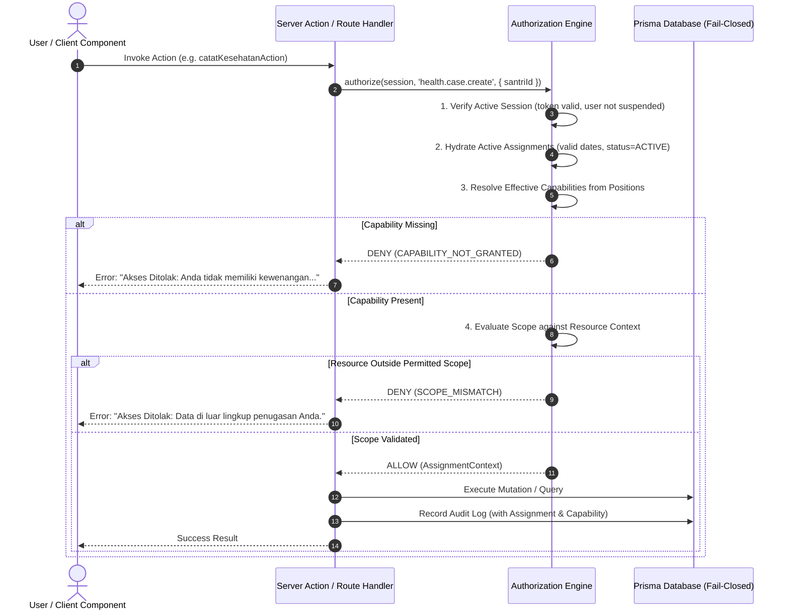

# STQ AUTHORIZATION MODEL — SPECIFICATION & ENGINE CONTRACT
**Deterministic, Server-Side, Capability-and-Scope Based Authorization Architecture**  
**Document**: `docs/STQ_AUTHORIZATION_MODEL.md`  
**Status**: `ARCHITECTURE_LOCKED`

---

## 1. The Core Authorization Formula

In the canonical architecture, authorization decisions do not evaluate hardcoded names, usernames, or coarse roles directly. Every decision is computed through the **Canonical Authorization Pipeline**:

$$\text{Decision} = \mathcal{F}(\text{Session}, \text{Capability}, \text{ResourceContext})$$

Expanded:
$$\text{User/Session} \xrightarrow{\text{hydrate}} \text{Active Assignments} \xrightarrow{\text{derive}} \{\text{Positions}\} \xrightarrow{\text{expand}} \{\text{Capabilities}\} \times \{\text{Scopes}\} \xrightarrow{\text{evaluate against}} \text{Resource Context} \implies \text{ALLOW} \mid \text{DENY}$$



---

## 2. Authorization Engine Public Contract (TypeScript API)

```typescript
/**
 * Canonical Authorization Engine Interface
 */

export type ScopeType =
  | "GLOBAL"
  | "DOMAIN"
  | "UNIT"
  | "ASSIGNED_UNITS"
  | "HALAQOH"
  | "KAMAR"
  | "OWN_CHILD"
  | "SELF";

export interface ResourceContext {
  santriId?: string;
  halaqohId?: string;
  kamarId?: string;
  unitId?: string;
  domainId?: string;
  targetUserId?: string;
  [key: string]: unknown;
}

export interface AuthorizationResult {
  allowed: boolean;
  code: "ALLOWED" | "UNAUTHENTICATED" | "CAPABILITY_NOT_GRANTED" | "SCOPE_MISMATCH" | "ASSIGNMENT_EXPIRED";
  reason?: string;
  effectiveScope?: ScopeType;
  assignmentId?: string;
  positionCode?: string;
}

export interface IAuthorizationEngine {
  /**
   * Evaluasi kewenangan penuh: memeriksa kapabilitas DAN kecocokan scope terhadap resource.
   */
  authorize(
    session: UserSession | null,
    capabilityCode: string,
    context?: ResourceContext
  ): Promise<AuthorizationResult>;

  /**
   * Memeriksa apakah sesi memiliki kapabilitas tertentu (tanpa memvalidasi resource context).
   */
  hasCapability(
    session: UserSession | null,
    capabilityCode: string
  ): Promise<boolean>;

  /**
   * Mengambil seluruh scope yang diizinkan untuk kapabilitas tertentu bagi sesi aktif.
   */
  resolveScopes(
    session: UserSession | null,
    capabilityCode: string
  ): Promise<{ scopeType: ScopeType; allowedUnitIds: string[] }>;

  /**
   * Helper filter Prisma query untuk membatasi read query otomatis berdasarkan scope.
   */
  buildScopeWhereClause<T>(
    session: UserSession | null,
    capabilityCode: string,
    targetField: string
  ): Promise<T>;
}
```

---

## 3. Evaluation Rules & Guarantees

### Rule 1: Fail-Closed Default Deny
- If `session` is `null` or invalid $\implies$ `DENY (UNAUTHENTICATED)`.
- If the requested capability is not mapped to any active assignment held by the user $\implies$ `DENY (CAPABILITY_NOT_GRANTED)`.
- If the database query to verify assignments fails or times out $\implies$ `DENY (SYSTEM_FAIL_CLOSED)`. No synthetic fallback is permitted.

### Rule 2: Active Assignment Validity Window
An assignment is valid if and only if:
1. `Assignment.status === "ACTIVE"`
2. `Assignment.validFrom <= now()`
3. `Assignment.validUntil === null || Assignment.validUntil >= now()`
4. `Staff.status === "AKTIF"` and `User.status === "AKTIF"`

Expired or revoked assignments immediately cease to confer capabilities, without requiring token re-issuance (session cache is invalidated upon assignment lifecycle events).

### Rule 3: Hierarchical Scope Resolution
When a user holds multiple assignments granting the same capability with different scopes:
- The engine computes the **union of permitted units** within the same domain.
- For example, if a Mudabbir is assigned to `Kamar A` and `Kamar B`, his effective unit list for `keasramaan.kamar.inspect` is `['Kamar A', 'Kamar B']`.
- If a user holds both `Position: KABID_TAHFIZH` (Scope: `GLOBAL_TAHFIZH`) and `Position: MUSYRIF_TAHFIZH` (Scope: `HALAQOH_RAZAN`):
  - For `tahfizh.recap.read`: Scope evaluates to `GLOBAL_TAHFIZH` (ALLOW).
  - For `tahfizh.setoran.create`: Scope evaluates to `HALAQOH` (strictly enclosed to `HALAQOH_RAZAN`). Kabid authority does not grant cross-halaqoh setoran writing!

---

## 4. Elimination of Legacy Anti-Patterns

| Legacy Anti-Pattern | Root Risk | Canonical Replacement |
| :--- | :--- | :--- |
| `if (session.username === 'musyrif.tahfizh')` | Coupes security to account username; breaks if username changes or another staff is promoted. | `hasCapability(session, 'tahfizh.reward.issue')` originating from `Position: KABID_TAHFIZH`. |
| `if (session.name.includes('Razan'))` | Plaintext name matching; highly vulnerable to typo or spoofing. | Strictly evaluate verified `staffId` through `Assignment`. |
| `Staff.isKepalaBidangTahfidz: Boolean` | Column proliferation; requires DB schema migration for every new organizational position. | Position: `KABID_TAHFIZH` assigned to Staff in Unit: `TAHFIZH`. |
| `User.isPetugasPresensiPutri: Boolean` | Column proliferation; creates arbitrary user-level exceptions. | Position: `PETUGAS_PRESENSI` assigned to Santriwati in Unit: `ASRAMA_PUTRI`. |
| `role === 'MT' ? ALL : BINAAN` | Conflates ordinary musyrif with supervisory management. | Ordinary MT holds `Position: MUSYRIF_TAHFIZH` (Scope: `HALAQOH`); Kabid holds `Position: KABID_TAHFIZH` (Scope: `DOMAIN`). |
| `PERMISSION_MATRIX[module][role]` (Coarse CRUD) | Cannot express "can create health record but cannot update clinical status". | Granular capabilities: `health.case.create` vs `health.status.update`. |

---

## 5. Standardized Error Protocol

When an action is denied, the authorization engine returns a typed error preventing information leakage while providing unambiguous operator feedback:

```json
{
  "success": false,
  "code": "ACCESS_DENIED",
  "message": "Akses Ditolak: Anda tidak memiliki kewenangan [tahfizh.reward.issue].",
  "audit": {
    "requiredCapability": "tahfizh.reward.issue",
    "requiredScope": "DOMAIN",
    "timestamp": "2026-09-17T08:50:00.000Z"
  }
}
```
All denial events are automatically recorded to `AuditLog` with action `SECURITY_ACCESS_DENIED`.
