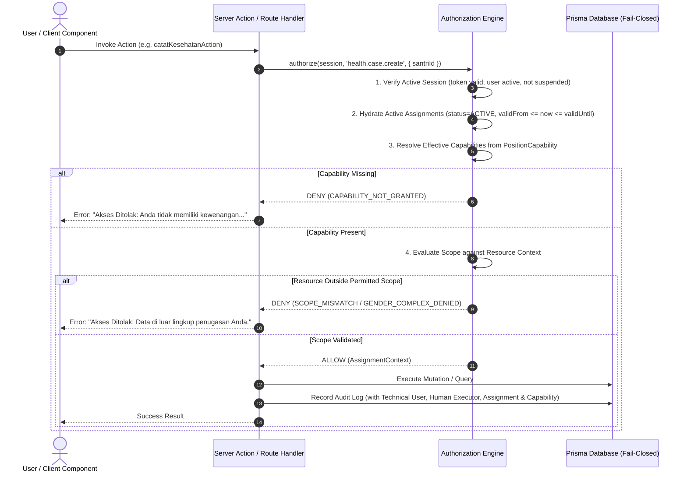

# STQ AUTHORIZATION MODEL — SPECIFICATION & ENGINE CONTRACT
**Deterministic, Server-Side, Capability-and-Scope Based Authorization Architecture**  
**Document**: `docs/STQ_AUTHORIZATION_MODEL.md`  
**Status**: `PROPOSED — PENDING BUSINESS OWNER / CHATGPT REVIEW`

---

## 1. The Core Authorization Formula

In the canonical architecture, authorization decisions do not evaluate hardcoded names, usernames, or coarse roles directly. Every decision is computed through the **Canonical Authorization Pipeline**:

$$\text{Decision} = \mathcal{F}(\text{Session}, \text{Capability}, \text{ResourceContext})$$

Expanded:
$$\text{User/Session} \xrightarrow{\text{hydrate}} \text{Active Assignments} \xrightarrow{\text{derive}} \{\text{Positions}\} \xrightarrow{\text{expand}} \{\text{Capabilities}\} \times \{\text{Scopes}\} \xrightarrow{\text{evaluate against}} \text{Resource Context} \implies \text{ALLOW} \mid \text{DENY}$$



---

## 2. Authorization Engine Public Contract (TypeScript API)

```typescript
/**
 * Canonical Authorization Engine Interface & Types
 * Normalized exactly across all layers supporting multi-grant evaluation.
 */

export type ScopeType =
  | "GLOBAL"
  | "DOMAIN"
  | "UNIT"
  | "ASSIGNED_UNITS"
  | "HALAQOH"
  | "KAMAR"
  | "OWN_CHILD"
  | "SELF";

/**
 * Caller-supplied resource parameters (Strictly untrusted target identifiers)
 * Callers can NEVER supply or influence permitted child IDs, authorization relations, or arbitrary keys.
 * No arbitrary index signature allowed.
 */
export interface RequestedResourceContext {
  santriId?: string;
  targetUserId?: string;
  resourceId?: string;
  halaqohId?: string;
  kamarId?: string;
  unitId?: string;
}

/**
 * Server-hydrated authoritative resource attributes evaluated by the authorization engine
 */
export interface ResolvedResourceContext {
  santriId?: string;
  halaqohId?: string;
  kamarId?: string;
  orgUnitIds: string[];
  guardianLinkedSantriIds?: string[]; // Authoritatively hydrated server-side from Guardian table
  genderComplex?: GenderComplex;
  orgDomain?: OrgDomain;
  [key: string]: unknown;
}

/**
 * Resolved capability grant derived from an active assignment and its position capabilities
 */
export interface EffectiveCapabilityGrant {
  assignmentId: string;
  positionCode: string;
  capabilityCode: string;
  scopeType: ScopeType;
  anchorUnitId: string;
  unitIds: string[];
  businessRuleState: BusinessRuleState;
}

export type AuthorizationResultCode =
  | "ALLOWED"
  | "UNAUTHENTICATED"
  | "IDENTITY_NOT_LINKED"
  | "IDENTITY_INACTIVE"
  | "CAPABILITY_NOT_GRANTED"
  | "INVALID_RESOURCE_CONTEXT"
  | "SCOPE_MISMATCH"
  | "ASSIGNMENT_NOT_ACTIVE"
  | "ASSIGNMENT_EXPIRED"
  | "GENDER_COMPLEX_DENIED"
  | "SYSTEM_FAIL_CLOSED";

export interface AuthorizationResult {
  allowed: boolean;
  code: AuthorizationResultCode;
  reason?: string;
  grantUsed?: EffectiveCapabilityGrant; // Identifies the specific grant that authorized the request
  effectiveScope?: ScopeType;
  assignmentId?: string;
  positionCode?: string;
  unitId?: string;
}

export interface IAuthorizationEngine {
  /**
   * Full server-side authorization check (Capability + Scope vs Authoritative Context).
   * Evaluates all effective grants; returns ALLOW if at least one grant matches.
   */
  authorize(
    session: UserSession | null,
    capabilityCode: string,
    context?: RequestedResourceContext
  ): Promise<AuthorizationResult>;

  /**
   * Coarse check if session holds capability regardless of scope (used for UI derivation).
   */
  hasCapability(
    session: UserSession | null,
    capabilityCode: string
  ): Promise<boolean>;

  /**
   * Resolves list of all currently active assignments for a given session.
   */
  getActiveAssignments(
    session: UserSession | null
  ): Promise<Assignment[]>;

  /**
   * Resolves all effective capability grants for a session and capability.
   */
  resolveScopes(
    session: UserSession | null,
    capabilityCode: string
  ): Promise<EffectiveCapabilityGrant[]>;

  /**
   * Helper filter to construct Prisma WHERE clause filters from effective scope.
   */
  buildScopeFilter?(
    session: UserSession | null,
    capabilityCode: string
  ): Promise<Record<string, unknown>>;
}
```

---

## 3. Evaluation Rules & Guarantees

### Rule 1: Fail-Closed Default Deny
- If `session` is `null` or invalid $\implies$ `DENY (UNAUTHENTICATED)`.
- If the authenticated user has no linked identity profile $\implies$ `DENY (IDENTITY_NOT_LINKED)`.
- If the user account is suspended or inactive $\implies$ `DENY (IDENTITY_INACTIVE)`.
- If the requested capability is not granted by any active assignment $\implies$ `DENY (CAPABILITY_NOT_GRANTED)`.
- If the database query to verify assignments fails or times out $\implies$ `DENY (SYSTEM_FAIL_CLOSED)`. No synthetic fallback is permitted.

### Rule 2: Active Assignment Validity Window & Fail-Closed Status Default
- `Assignment.status` strictly defaults to `@default(DRAFT)` (never defaults to `ACTIVE`). An assignment created with omitted status confers **ZERO authority**.
- An assignment is valid if and only if:
  1. `Assignment.status === "ACTIVE"` (assignments in `DRAFT`, `SUSPENDED`, `EXPIRED`, or `REVOKED` grant zero authority).
  2. `Assignment.validFrom <= now()`
  3. `Assignment.validUntil === null || Assignment.validUntil >= now()`
  4. `User.status === "AKTIF"` and linked `Staff`/`Santri` is active.

Expired assignments cease conferring authority immediately upon passing `validUntil`.

### Rule 3: Capability Precedence Over Scope & No Pseudo-Scopes
- **Capability is evaluated before scope**: Holding `GLOBAL` scope on one capability (e.g. `health.case.read_aggregate + GLOBAL`) confers zero authority over unrelated capabilities (e.g. `tahfizh.reward.issue`). `GLOBAL` denotes institutional scope for the granted capability only.
- **No Pseudo-Scopes**: The architecture strictly forbids arbitrary concatenated string pseudo-scopes (such as appending domain or halaqoh names to scope types).
  - To express domain-wide supervision for Kabid Tahfizh:
    `scopeType = "DOMAIN"`, evaluated in unit `Unit: TAHFIZH` (domain: `TAHFIZH`).
  - To express own halaqoh setoran writing for Musyrif Tahfizh:
    `scopeType = "HALAQOH"`, evaluated against `Halaqoh.id === santri.halaqohId`.
  - For example, when a staff member holds both `KABID_TAHFIZH` and `MUSYRIF_TAHFIZH` (illustrative example: Ust. Razan):
    - For `tahfizh.recap.read`: Evaluates against `PositionCapability` having `scopeType: "DOMAIN"` $\implies$ ALLOW (institutional halaqoh recap).
    - For `tahfizh.setoran.create`: Evaluates against `PositionCapability` having `scopeType: "HALAQOH"` $\implies$ Bounded strictly to assigned halaqoh.

### Rule 4: Server-Side Relational Multi-Child Guardian Evaluation (`OWN_CHILD`)
- `OWN_CHILD` is evaluated relationally server-side:
  $$\text{Resource}.\text{santriId} \in \text{ResolvedResourceContext}.\text{guardianLinkedSantriIds}$$
- The engine does NOT accept caller-supplied child IDs. The server hydrates `guardianLinkedSantriIds` from authoritative `Guardian` database records. Callers can never supply or influence permitted child IDs. A guardian with multiple enrolled children can access records for any of their relationally linked children.

### Rule 5: Gender Complex Boundary Separation (`GENDER_COMPLEX_DENIED`)
- `SCOPE_MISMATCH` indicates a standard organizational unit boundary failure (e.g. Musyrif A attempting to edit Musyrif B's halaqoh).
- `GENDER_COMPLEX_DENIED` is a specialized, audited rejection that triggers when an actor attempts cross-gender boundary access (e.g. ikhwan personnel attempting to access akhwat dormitory or halaqoh records) without an explicit, approved cross-complex operational assignment.
- `OrgUnit.genderComplex` is mandatory with **NO default**. Omission can never silently classify a unit as `CAMPUR`.

### Rule 6: Unit Account One-Placement Invariant & Fail-Closed Anchor Check
- Accounts of type `AccountType.UNIT` represent operational kiosks or stations.
- Each `AccountType.UNIT` user must have exactly one relational `UnitAccountPlacement` record.
- When evaluating assignments for a UNIT account, the engine enforces:
  $$\text{Assignment}.\text{unitId} \equiv \text{UnitAccountPlacement}.\text{unitId}$$
- If an assignment anchor unit contradicts the account's canonical `UnitAccountPlacement`, the engine **strictly fails closed** with `SYSTEM_FAIL_CLOSED` or `SCOPE_MISMATCH`. UNIT assignments cannot span different placements.

### Rule 7: Policy Grant Lifecycle State Enforcement & Fail-Closed Invariant
- **Zero Authority on Non-Authoritative State**: A `PositionCapability` with missing, unknown, unsupported, or non-authoritative `BusinessRuleState` MUST confer **ZERO authority**. The Authorization Engine strictly fails closed.
- **Fail-Closed Default**: Candidate Prisma schema defaults `PositionCapability.businessRuleState @default(PROPOSED_TBD)` (never defaults to `VERIFIED_PRODUCTION`). Developer omission can NEVER silently produce an active `VERIFIED_PRODUCTION` grant.
- **Phase Enforcement**:
  - Phase A/B compatibility: Only **`VERIFIED_PRODUCTION`** grants are active.
  - Phase D target cutover: **`APPROVED_TARGET_PENDING_TECHNICAL`** becomes authoritative only after an explicit approved cutover/migration decision.
  - **`PROPOSED_TBD`**: Never authoritative under any circumstance.
- **Explicit Phase B Backfill**: Compatibility grants created during Phase B backfill MUST specify `businessRuleState = VERIFIED_PRODUCTION` explicitly. No automatic or inferred promotion from Position name, Role, or username is permitted.

### Rule 8: The Explicit Activation Triple (Fail-Closed Default Closure)
For any effective authority to exist during Phase A/B, all three security dimensions must be deliberate:
1. **Assignment**: `status === ACTIVE` (candidate schema defaults fail-closed to `@default(DRAFT)`).
2. **PositionCapability**: `businessRuleState === VERIFIED_PRODUCTION` (candidate schema defaults fail-closed to `@default(PROPOSED_TBD)`).
3. **PositionCapability**: `scopeType` explicitly declared (mandatory, NO default; never inferred from anchor unit).
*Plus*: Target resource context must match the explicit scope and `genderComplex` boundary.
*If any required dimension is missing, unapproved, or invalid: DENY / FAIL CLOSED.*

---

## 4. Elimination of Legacy Anti-Patterns

| Legacy Anti-Pattern | Root Risk | Canonical Replacement |
| :--- | :--- | :--- |
| `if (session.username === 'musyrif.tahfizh')` | Couples security to account username; breaks if username changes or another staff is promoted. | `hasCapability(session, 'tahfizh.reward.issue')` originating from active `Position: KABID_TAHFIZH`. |
| `if (session.name.includes('Razan'))` | Plaintext name matching; vulnerable to typo or spoofing. | Strictly evaluate verified `userId`/`staffId` through active `Assignment`. |
| `Staff.isKepalaBidangTahfidz: Boolean` | Column proliferation; requires DB schema migration for every new organizational position. | Position: `KABID_TAHFIZH` assigned to User in Unit: `TAHFIZH`. |
| `User.isPetugasPresensiPutri: Boolean` | Column proliferation; creates arbitrary user-level exceptions. | Position: `PETUGAS_PRESENSI` assigned to User in Unit: `ASRAMA_PUTRI`. |
| `role === 'MT' ? ALL : BINAAN` | Conflates ordinary musyrif with supervisory management. | Ordinary MT holds `Position: MUSYRIF_TAHFIZH` (`Scope: HALAQOH`); Kabid holds `Position: KABID_TAHFIZH` (`Scope: DOMAIN`). |
| `Non-relational string arrays` | Free-form strings without FK integrity; risk of orphaned IDs. | Relational `AssignmentScopeUnit` table with strict foreign key constraints. |
| `PERMISSION_MATRIX[module][role]` (Coarse CRUD) | Cannot express "can create health record but cannot update clinical status". | Granular capabilities: `health.case.create` vs `health.case.update_status`. |
