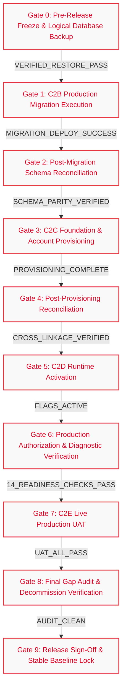
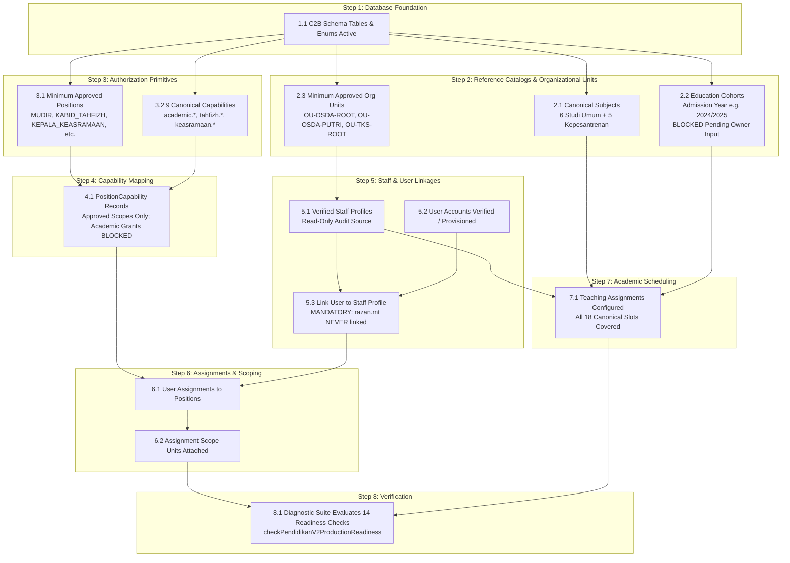

# STQ EDUCATION PORTAL — M3.3 RELEASE DEPENDENCY GRAPH & SEQUENCING
**Strict Fail-Closed Production Execution Gates & Dependency Tree**
**Document**: `docs/STQ_M3_RELEASE_DEPENDENCIES.md`
**Status**: `CONTROL_PLANE_ACTIVE`
**Baseline Commit (`main`)**: `8e670491d1ed0c88a480ed90186153e96ca1dea3`
**Protected PR #8**: `9068cae5587b7219c394c5c25bf0de07a15b0726` (**OPEN / DRAFT / UNMERGED**)
**Production Mutations**: `0` (**STRICTLY PROHIBITED**)

---

## 1. Release Control Plane Lifecycle & Execution Precedence

Before any production operation begins, the governance and planning control plane must exist on canonical `main`:

```
┌──────────────────────────────────────────────────────────────────────────────────────────────────┐
│                                   RELEASE CONTROL PLANE LIFECYCLE                                │
│                                                                                                  │
│   PR #25 (Control Plane)                                                                         │
│          ▼                                                                                       │
│   Independent Audit & Remediation Verification                                                   │
│          ▼                                                                                       │
│   Business Owner Merge Authorization                                                             │
│          ▼                                                                                       │
│   Merge PR #25 to Canonical `main` & Post-Merge CI Verification                                  │
│          ▼                                                                                       │
│   Production Release Execution Commences (Gate 0 through Gate 9)                                 │
└──────────────────────────────────────────────────────────────────────────────────────────────────┘
```

> [!IMPORTANT]
> PR #25 is NOT held open during Gate 0 through Gate 9. The control plane must be merged to canonical `main` before production release operations commence. Subsequent evidence packs and verification logs will be tracked via dedicated controlled follow-up PRs.

---

## 2. Linear Release Gate Sequence

The STQ Education Portal Release Train enforces a strictly linear, fail-closed execution sequence across 10 discrete gates (Gate 0 through Gate 9). No stage may begin until all upstream exit criteria are verified by immutable evidence packs and signed off.



### Gate Execution Summary Table

| Gate ID | Stage Name | Upstream Prerequisite | Core Execution Scope | Automated Exit Criteria | Downstream Unlocked | Status |
| :--- | :--- | :--- | :--- | :--- | :--- | :--- |
| **Gate 0** | **Pre-Release Freeze & Logical Backup** | Business Owner Authorization | PostgreSQL logical dump (`pg_dump -F p`, plain SQL) + SHA-256 checksum + dry-run plain SQL restore (`psql`) into scratch DB. Client `pg_dump` major version $\ge$ server major version. Dynamic verification: `RESTORED_T0 == SOURCE_T0`. | Restore verification log confirms restored table row counts, schema catalog, and migration ledger match T0 snapshot | Gate 1 (C2B Migration) | **BLOCKED** *(Awaiting tooling & connection)* |
| **Gate 1** | **C2B Production Migration** | Gate 0 signed off | Re-verify historical migration checksum/readiness; execute authorized repository migration chain:<br/>`20260918120000_m3_3a_health_v2_backend`<br/>$\\rightarrow$ `20260918140000_m3_3b_pendidikan_foundation`<br/>$\\rightarrow$ `20260920080000_prelaunch_reconciliation`.<br/>*Honesty Distinction*: Keep `REPOSITORY_MIGRATION_CHAIN` (exact 3-step repository migration chain) distinct from `PRODUCTION_APPLIED_OR_PENDING_STATE` (`HISTORICAL_POINT_IN_TIME / REQUIRES_FRESH_READ_ONLY_VERIFICATION`). Zero production access is performed during pre-gate reconciliation; do not label migrations as "currently pending in production" without fresh authoritative production evidence. PR #8 reconciliation was completed in PR #23. | Migration deploy returns exit code 0; `_prisma_migrations` contains all applied records | Gate 2 (Schema Reconciliation) | **NOT_READY** *(Gated by Gate 0)* |
| **Gate 2** | **Post-Migration Reconciliation** | Gate 1 successful | Introspect production database information schema; verify existence of all required tables, columns, indexes, and enums | 0 missing tables; 0 column mismatches; Prisma validation passes cleanly | Gate 3 (C2C Provisioning) | **NOT_READY** *(Gated by Gate 1)* |
| **Gate 3** | **C2C Foundation & Provisioning** | Gate 2 verified | Seed canonical subjects, minimum approved org units (`OU-OSDA-ROOT`, `OU-OSDA-PUTRI`, `OU-TKS-ROOT`), approved positions, 9 UAT capabilities, verified staff profiles, and user assignments. Cohort creation remains blocked pending owner admission data. | Database insert logs show expected row count; zero identity linkage violations | Gate 4 (Provisioning Reconciliation) | **NOT_READY** *(Gated by Gate 2)* |
| **Gate 4** | **Post-Provisioning Reconciliation** | Gate 3 completed | Verify staff-to-account linkages, teaching assignment coverage (18 slots), and `razan.mt` decommission/isolation state | Linkage audit shows `razan.mt` has 0 staff links; all 18 teaching slots filled with valid staff IDs | Gate 5 (C2D Activation; strictly contingent on zero academic blockers) | **NOT_READY** *(Gated by Gate 3)* |
| **Gate 5** | **C2D Runtime Activation (Pendidikan V2 Server Flag)** | ALL of: Gate 2 C2B schema reconciliation PASS; Gate 4 C2C prerequisite provisioning PASS; academic capability registration complete; academic PositionCapability policy explicitly approved; teacher account modality resolved; teacher User/Staff identity linkage verified; academic resource/unit containment resolved; required academic Assignments resolved; relevant TeachingAssignments verified; Business Owner explicit C2D authorization. If ANY remains PROPOSED_TBD / BLOCKED, PENDIDIKAN_V2_UAT_ENABLED MUST REMAIN FALSE. | Set `PENDIDIKAN_V2_UAT_ENABLED=true` in production environment only after all prerequisites pass | Server config inspection verifies flag is active; endpoint responds with authoritative DTO | Gate 6 (Auth Diagnostic) | **BLOCKED** *(Blocked by academic grant policy, teacher modality, and unit containment)* |
| **Gate 6** | **Authorization & Diagnostic Verification** | Gate 5 active | Run `checkPendidikanV2ProductionReadiness` against live production instance | All 14 canonical readiness checks evaluate to `READY: true` (or compliant non-blocking/deferred status per contract); zero deny errors on valid tokens. Note: internal readiness checks are diagnostic controls and do not replace Release Gates 0–9. | Gate 7 (Live UAT) | **NOT_READY** *(Gated by Gate 5)* |
| **Gate 7** | **C2E Live Production UAT** | Gate 6 passed | Execute live scenarios UAT-01 through UAT-09 with designated test accounts (UAT-04 restricted strictly to Kepesantrenan attendance) | 100% scenario test passes; sanitized audit logs capture all session transitions and mutations | Gate 8 (Final Audit) | **NOT_READY** *(Gated by Gate 6)* |
| **Gate 8** | **Final Gap Audit & Decommission State Re-Verification** | Gate 7 passed | Final re-verification only: confirm `razan.mt` decommission state (mutated during C2C after dependency audit & authorization) remains fully intact in schema and sessions; audit all logs for unintended side-effects | `razan.mt` decommissioned/deactivated state verified; zero anomalous audit log entries | Gate 9 (Stable Baseline) | **NOT_READY** *(Gated by Gate 7)* |
| **Gate 9** | **Release Sign-Off & Stable Baseline** | Gate 8 passed | Compile Master Evidence Pack; produce walkthrough; Business Owner signs off | Formal signed document; baseline tagged in Git | **STABLE BASELINE** | **NOT_READY** *(Gated by Gate 8)* |

---

## 3. Granular Internal C2C Provisioning Dependency Hierarchy

Within Gate 3 (`C2C Foundation & Account Provisioning`), operations must execute in a strict bottom-up relational order:



### Granular Step Details & Invariants
1. **Step 1.1 (Schema Verification)**: Verify presence of C2B tables and enums before executing any seed scripts.
2. **Step 2.1 (Subjects Catalog)**: Insert/Verify 6 canonical Studi Umum subjects (`MP-SU-01` to `MP-SU-06`) and 5 Kepesantrenan subjects.
3. **Step 2.2 (Cohorts Catalog)**: `EducationCohort` represents permanent admission year cohorts (e.g. `2024/2025`, `2025/2026`). School class attribute, gender, age, and Tingkat Studi Umum (1/2/3 - current program position) must NEVER define EducationCohort. Dynamic rule: 100% of the authoritatively in-scope active santri captured at C2C preflight must have an approved permanent cohort mapping, or the cohort gate remains `BLOCKED`. EducationCohort enforces `code @unique`. Creation and backfill remain strictly `BLOCKED` until authoritative Business Owner admission data is provided.
4. **Step 2.3 (OrgUnits Catalog)**: Insert/Verify exact minimum approved gate set: `OU-OSDA-ROOT`, `OU-OSDA-PUTRI`, `OU-TKS-ROOT`. Additional organizational units (`OU-INSTITUTION`, `OU-TAHFIZH`, `OU-KEASRAMAAN`, `OU-AKADEMIK`, `OU-MANAJEMEN`) remain `PROPOSED_TBD` and are not approved for C2C production seeding without explicit canonical authority.
5. **Step 3.1 & 3.2 (Positions & Capabilities)**: Ensure the 9 required UAT capabilities are registered in database. Minimum approved position templates are strictly limited to the canonical gate set: `MUDIR`, `KABID_TAHFIZH`, `KEPALA_KEASRAMAAN`, `PETUGAS_OPERASIONAL_TAHFIZH`, `MUSYRIF_TAHFIZH`, `PEMBINA_HALAQOH`, `PETUGAS_OPERASIONAL_KEASRAMAAN`. Do not create synonym or duplicate position codes (`KEPALA_BIDANG_TAHFIZH`, `MUSYRIF_KEASRAMAAN`, `KEPALA_SEKOLAH`). Note: `GURU_KEPESANTRENAN` is formalized as an approved canonical position contract under PERSONAL modality (PR #29 / DIR-2026-028). Additional unapproved positions are `PROPOSED_TBD / DEFERRED`.
6. **Step 4.1 (PositionCapabilities)**: Map capabilities strictly to approved target scopes:
   - `tahfizh.recap.read`: `GLOBAL` for `PETUGAS_OPERASIONAL_TAHFIZH` (read-only); `DOMAIN` for `KABID_TAHFIZH`; `GLOBAL` for `MUDIR`.
   - `tahfizh.reward.issue`: `DOMAIN` for `KABID_TAHFIZH`; `GLOBAL` for `MUDIR`. (Note: prior target policy for `PETUGAS_OPERASIONAL_TAHFIZH` with `ASSIGNED_UNITS` is formally SUPERSEDED per `DIR-2026-023`).
   - `tahfizh.target.manage`: `HALAQOH` for `MUSYRIF_TAHFIZH` and `PEMBINA_HALAQOH`.
   - `keasramaan.permission.read`: `ASSIGNED_UNITS` for `PETUGAS_OPERASIONAL_KEASRAMAAN`.
   - `keasramaan.permission.create`: `ASSIGNED_UNITS` for `PETUGAS_OPERASIONAL_KEASRAMAAN`.
   - **Academic PositionCapabilities Policy (`REL-PC-04`)**: The four academic capabilities (`academic.schedule.read`, `academic.session.start`, `academic.material.record`, `academic.attendance.record`) are REQUIRED in capability registration. Teacher account modalities are resolved for Studi Umum as `SUBJECT` modality (PR #28 / DIR-2026-027) and for Kepesantrenan as `PERSONAL` modality under `GURU_KEPESANTRENAN` (PR #29 / DIR-2026-028). Activation remains gated by sequential release controls.
   *(No unapproved scopes, no invented UNIT scope for Keasramaan, no KAMAR grants, no speculative GLOBAL academic grants).*
7. **Step 5.1 to 5.3 (Staff & User Linkage)**:
   - Verify staff profiles based on read-only production audit without inventing unverified Staff ID assignments.
   - `musyrif.tahifzh` staff linkage is `UNKNOWN / MUST_VERIFY_READ_ONLY`.
   - `musyrifah.putri` and `pembina.halaqoh`: `ACCOUNT_MODALITY = UNRESOLVED / MUST_VERIFY` (`PolicyDecisionState: PROPOSED_TBD`). Canonical Assignment authority = 0; legacy runtime authority must be audited and may exist in production until explicit cutover. Read-only effective access audit required prior to C2C.
   - **`razan.mt` Decommission Lifecycle**: `razan.mt` must NEVER be linked to Staff `STF-0003` or any Staff profile. Target state is decommission via schema-supported deactivation/revocation (`status = NONAKTIF` or `SUSPENDED`). The controlled deactivation mutation belongs to authorized C2C account cleanup after read-only dependency audit and explicit owner authorization. Gate 8 serves strictly as final re-verification of this decommission state, not the initial mutation.
8. **Step 6.1 & 6.2 (Assignments & Scope Units)**:
   - Create user assignments with active Staff profile enforcement for personal accounts, and human executor attribution for unit accounts. Attach unit containment where applicable.
   - **Academic Teacher Assignments (`REL-ASN-04`) and Scope Units (`REL-ASU-03`)**: Both are classified as `BLOCKED / PROPOSED_TBD`. Because `REL-PC-04` is blocked, teacher account modality is unresolved, and academic unit containment is unresolved, no active canonical academic Assignment may be provisioned. Furthermore, `AssignmentScopeUnit.unitId` strictly references `OrgUnit.id`; cohort IDs and subject IDs are NOT OrgUnit IDs and cannot be bound as pseudo-OrgUnits. Academic containment remains `ACADEMIC_UNIT_CONTAINMENT = BLOCKED_TECHNICAL` until an authoritative model is approved.
9. **Step 7.1 (Teaching Assignments)**: Configure teaching assignments modeling subject + education track + gender complex + optional pedagogical level + validity period (Prisma fields: `mapelId`, `staffId`, `educationTrack`, `genderComplex`, `pedagogicalLevel`, `validFrom`, `validUntil`). Note: `TeachingAssignment` does NOT contain `cohortId` (cohort assignment is held independently on `EducationSession`). All 18 canonical slots covered.
   - **TeachingAssignment vs Canonical Assignment Distinction**: Keep these concepts distinct: `TeachingAssignment` (Step 7.1) is the scheduled pedagogical Staff assignment for subject/track/gender/level. A valid `TeachingAssignment` alone does NOT confer canonical runtime authority. Canonical `Assignment` (Step 6.1) is the `User -> Position -> OrgUnit` authorization anchor. Canonical `Assignment` alone does not prove a teacher is scheduled for a particular `EducationSession`. Both layers are required and independently evaluated.
10. **Step 8.1 (Diagnostic Execution)**: Run `checkPendidikanV2ProductionReadiness()`. Evaluates the 14 internal readiness checks from canonical registry `CANONICAL_READINESS_GATE_NAMES`:
    1. `M3_3A_SCHEMA_READY` (blocking: true; validates Health V2 schema tables and enums)
    2. `M3_3B_SCHEMA_READY` (blocking: true; validates Pendidikan V2 foundation tables and enums)
    3. `CANONICAL_AUDIT_READY` (blocking: true; validates canonical_audit_logs table)
    4. `STAFF_LINKAGE_READY` (blocking: true; validates operational accounts link to active Staff; razan.mt unlinked)
    5. `REQUIRED_ORG_UNITS_READY` (blocking: true; validates minimum approved units: OU-OSDA-ROOT, OU-OSDA-PUTRI, OU-TKS-ROOT)
    6. `REQUIRED_POSITIONS_READY` (blocking: true; validates approved position templates)
    7. `CAPABILITIES_REGISTERED` (blocking: true; validates required UAT activation capabilities)
    8. `USER_ASSIGNMENTS_READY` (blocking: true; validates user assignments and scope constraints)
    9. `TEACHING_ASSIGNMENTS_READY` (blocking: true; validates Kepesantrenan teaching slots)
    10. `KEPESANTRENAN_ACADEMIC_AUTH_POLICY_READY` (blocking: true; validates explicit owner-approved PositionCapability for GURU_KEPESANTRENAN with businessRuleState VERIFIED_PRODUCTION)
    11. `STALE_POSITION_CAPABILITY_POLICY_READY` (blocking: true; rejects stale PETUGAS_OPERASIONAL_TAHFIZH -> tahfizh.reward.issue)
    12. `COHORTS_ASSIGNED` (blocking: false / DEFERRED_INFORMATIONAL; cohort assignment deferred by owner lock, COHORT_NOT_REQUIRED_FOR_RUNTIME)
    13. `KEASRAMAAN_KAMAR_CONFIGURATION_READY` (Case A: 0 active kamar => NOT_READY, CONFIGURATION_NOT_CREATED / DEFERRED, blocking: false; Case B: >0 active kamar => validates topology/placements/assignments, blocking: true; DB failure => BLOCKED, blocking: true)
    14. `RUNTIME_ACTIVATION_FLAG` (blocking: true; validates PENDIDIKAN_V2_UAT_ENABLED === "true")
    All blocking checks must evaluate to `READY: true` (or compliant non-blocking/deferred state). Internal readiness checks are diagnostic controls and do not replace Release Gates 0–9.

---

## 4. Fail-Closed Dependency Rules & Automated Halt Triggers

### Rule 1: Fail-Closed Sequential Blocking
- **Specification**: If any verification step or exit criterion in Gate $N$ fails, all actions in Gate $N+1$ and beyond are **immediately blocked**.
- **Action on Failure**: Abort deployment; log error details; preserve pre-failure database state; notify Business Owner.

### Rule 2: Zero Speculative Execution
- **Specification**: No task may execute on the assumption that an upstream task will succeed.
- **Enforcement**: Automated pre-check guards query database catalog and configuration state before initiating mutations.

### Rule 3: Strict Backup Prerequisites & Tooling Parity
- **Specification**: Production writes are strictly prohibited until a logical PostgreSQL backup (`pg_dump -F p`, plain SQL) is verified via automated restore (`psql`) into a temporary scratch instance, confirming `RESTORED_T0 == SOURCE_T0`.
- **Backup Tooling Major Version Guard**: `scripts/backup-db.ts` checks `pg_dump` availability and version string, but client major vs server major fail-closed check (`client_major < server_major => FAIL_CLOSED`) is NOT currently implemented by `backup-db.ts` itself (`PG_DUMP_MAJOR_COMPATIBILITY_GUARD = REQUIRED / NOT_IMPLEMENTED_IN_BACKUP_SCRIPT`).
- **Gate 0 Blocker**: Gate 0 remains `BLOCKED` until either: (A) an audited tooling implementation enforces it, or (B) an explicitly defined audited preflight step performs the read-only server/client version comparison before backup execution.
- **Enforcement**: Deployment scripts require valid `BACKUP_VERIFICATION_PASS` token containing backup file SHA-256, server version parity record, and restore row-count checksums matching T0 snapshot.

### Rule 4: Zero Manual Overrides
- **Specification**: Engineers cannot bypass failing gates or missing requirements using manual flags, ad-hoc SQL, or temporary environment overrides.
- **Enforcement**: Any policy or configuration change requires a committed Git artifact reviewed and approved by the Business Owner.

### Rule 5: Schema Drift & Checksum Hard Stop
- **Specification**: If the checksum of any applied migration in `_prisma_migrations` does not match the repository migration file SHA, execution halts immediately.
- **Enforcement**: `prisma migrate status` and migration ledger parity tests enforce 100% hash parity.

### Rule 6: Identity Linkage Protection Guard
- **Specification**: Operational personal accounts without verified Staff profiles must never be granted operational capabilities. Deprecated accounts (e.g. `razan.mt`) are permanently blocked from linkage. Attempted linkage fails closed.
- **Enforcement**: Pre-provisioning assert fails closed if `userId === 'razan.mt'` is targeted for Staff assignment.

### Rule 7: Abort & Assess Trigger on Migration Stalls
- **Specification**: Any unexpected migration delay, transaction freeze, or lock contention acts as an ABORT/ASSESS trigger: stop further release stages, inspect database state. Do NOT automatically restore production. Restore from backup only when failure state necessitates recovery and action is explicitly authorized according to the release incident procedure.

### Rule 8: Non-Destructive Rollback Protocol
- **Specification**: Generic destructive rollback (e.g. automatic deletion of rows, blanket-nulling fields) is strictly prohibited.
- **Enforcement**: If an operation fails mid-way: `STOP -> preserve evidence -> inspect transaction state -> compare exact before-state -> use transaction rollback when still possible -> otherwise perform only explicitly authorized compensating action based on exact created/changed IDs and captured before-state.` Never run corrective production writes from a validation step alone.

### Rule 9: Gate 3 / Gate 4 / Gate 5 Academic Blocker Invariant
- **Specification**: An upstream generic Gate 4 status CANNOT bypass an explicit academic blocker. Gate 5 C2D Pendidikan activation requires ALL of:
  1. C2B schema reconciliation PASS
  2. C2C prerequisite provisioning PASS
  3. Academic capability registration complete
  4. Academic PositionCapability policy explicitly approved
  5. Teacher account modality resolved
  6. Teacher User/Staff identity linkage verified
  7. Academic resource/unit containment resolved
  8. Required academic Assignments resolved
  9. Relevant TeachingAssignments verified
  10. Business Owner explicit C2D authorization
- **Enforcement**: If ANY of the above remains `PROPOSED_TBD / BLOCKED`, `PENDIDIKAN_V2_UAT_ENABLED` MUST REMAIN `FALSE`.
