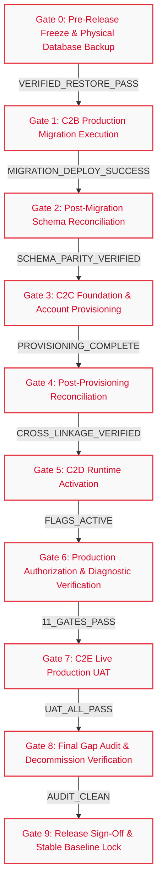
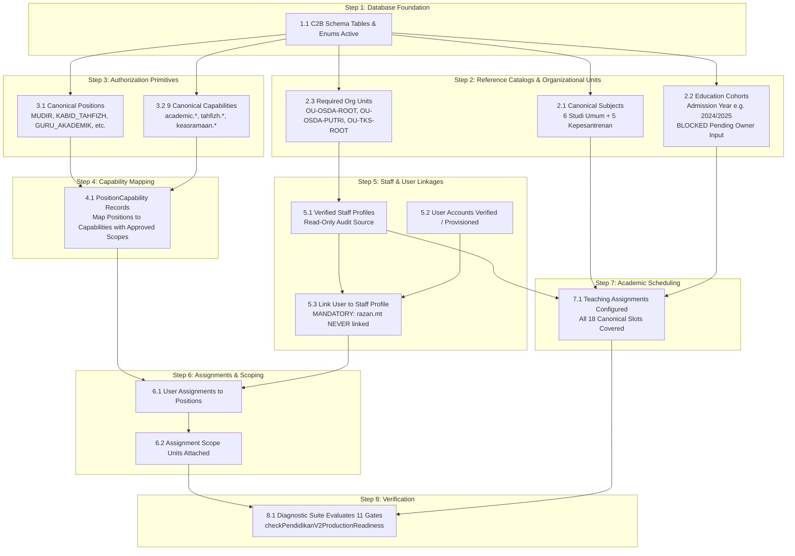

# STQ EDUCATION PORTAL — M3.3 RELEASE DEPENDENCY GRAPH & SEQUENCING
**Strict Fail-Closed Production Execution Gates & Dependency Tree**
**Document**: `docs/STQ_M3_RELEASE_DEPENDENCIES.md`
**Status**: `CONTROL_PLANE_ACTIVE`
**Baseline Commit (`main`)**: `8e670491d1ed0c88a480ed90186153e96ca1dea3`
**Protected PR #8**: `9068cae5587b7219c394c5c25bf0de07a15b0726` (**OPEN / DRAFT / UNMERGED**)
**Production Mutations**: `0` (**STRICTLY PROHIBITED**)

---

## 1. Release Control Plane Lifecycle & Execution Precedence

Before any production operation begins, the governance and planning control plane must exist on canonical `main`:

```
┌──────────────────────────────────────────────────────────────────────────────────────────────────┐
│                                   RELEASE CONTROL PLANE LIFECYCLE                                │
│                                                                                                  │
│   PR #25 (Control Plane)                                                                         │
│          ▼                                                                                       │
│   Independent Audit & Remediation Verification                                                   │
│          ▼                                                                                       │
│   Business Owner Merge Authorization                                                             │
│          ▼                                                                                       │
│   Merge PR #25 to Canonical `main` & Post-Merge CI Verification                                  │
│          ▼                                                                                       │
│   Production Release Execution Commences (Gate 0 through Gate 9)                                 │
└──────────────────────────────────────────────────────────────────────────────────────────────────┘
```

> [!IMPORTANT]
> PR #25 is NOT held open during Gate 0 through Gate 9. The control plane must be merged to canonical `main` before production release operations commence. Subsequent evidence packs and verification logs will be tracked via dedicated controlled follow-up PRs.

---

## 2. Linear Release Gate Sequence

The STQ Education Portal Release Train enforces a strictly linear, fail-closed execution sequence across 10 discrete gates (Gate 0 through Gate 9). No stage may begin until all upstream exit criteria are verified by immutable evidence packs and signed off.



### Gate Execution Summary Table

| Gate ID | Stage Name | Upstream Prerequisite | Core Execution Scope | Automated Exit Criteria | Downstream Unlocked | Status |
| :--- | :--- | :--- | :--- | :--- | :--- | :--- |
| **Gate 0** | **Pre-Release Freeze & Real Backup** | Business Owner Authorization | Physical PostgreSQL dump (`pg_dump -Fc`) using least privilege + SHA-256 checksum + dry-run restore into scratch DB | Restore verification log matches original table counts and row checksums without logging raw data | Gate 1 (C2B Migration) | **BLOCKED** *(Awaiting tooling & connection)* |
| **Gate 1** | **C2B Production Migration** | Gate 0 signed off | Re-verify historical migration checksum/readiness; execute pending authorized migrations (`20260918120000_m3_3a_health_v2_backend`, `20260918140000_m3_3b_pendidikan_foundation`). PR #8 reconciliation was completed in PR #23. | Migration deploy returns exit code 0; `_prisma_migrations` contains all applied records | Gate 2 (Schema Reconciliation) | **NOT_READY** *(Gated by Gate 0)* |
| **Gate 2** | **Post-Migration Reconciliation** | Gate 1 successful | Introspect production database information schema; verify existence of all required tables, columns, indexes, and enums | 0 missing tables; 0 column mismatches; Prisma validation passes cleanly | Gate 3 (C2C Provisioning) | **NOT_READY** *(Gated by Gate 1)* |
| **Gate 3** | **C2C Foundation & Provisioning** | Gate 2 verified | Seed canonical subjects, org units, positions, 9 UAT capabilities, verified staff profiles, and user assignments. Cohort creation remains blocked pending owner admission data. | Database insert logs show expected row count; zero identity linkage violations | Gate 4 (Provisioning Reconciliation) | **NOT_READY** *(Gated by Gate 2)* |
| **Gate 4** | **Post-Provisioning Reconciliation** | Gate 3 completed | Verify staff-to-account linkages, teaching assignment coverage (18 slots), and `razan.mt` decommission/isolation state | Linkage audit shows `razan.mt` has 0 staff links; all 18 teaching slots filled with valid staff IDs | Gate 5 (C2D Activation) | **NOT_READY** *(Gated by Gate 3)* |
| **Gate 5** | **C2D Runtime Activation** | Gate 4 verified | Set `PENDIDIKAN_V2_UAT_ENABLED=true` in production environment | Server config inspection verifies flag is active; endpoint responds with authoritative DTO | Gate 6 (Auth Diagnostic) | **NOT_READY** *(Gated by Gate 4)* |
| **Gate 6** | **Authorization & Diagnostic Verification** | Gate 5 active | Run `checkPendidikanV2ProductionReadiness` against live production instance | All 11 canonical readiness gates evaluate to `READY: true`; zero deny errors on valid tokens | Gate 7 (Live UAT) | **NOT_READY** *(Gated by Gate 5)* |
| **Gate 7** | **C2E Live Production UAT** | Gate 6 passed | Execute live scenarios UAT-01 through UAT-09 with designated test accounts | 100% scenario test passes; sanitized audit logs capture all session transitions and mutations | Gate 8 (Final Audit) | **NOT_READY** *(Gated by Gate 6)* |
| **Gate 8** | **Final Gap Audit & Decommissioning** | Gate 7 passed | Verify decommission of `razan.mt` via schema-supported deactivation; audit all logs for unintended side-effects | `razan.mt` decommissioned/deactivated; zero anomalous audit log entries | Gate 9 (Stable Baseline) | **NOT_READY** *(Gated by Gate 7)* |
| **Gate 9** | **Release Sign-Off & Stable Baseline** | Gate 8 passed | Compile Master Evidence Pack; produce walkthrough; Business Owner signs off | Formal signed document; baseline tagged in Git | **STABLE BASELINE** | **NOT_READY** *(Gated by Gate 8)* |

---

## 3. Granular Internal C2C Provisioning Dependency Hierarchy

Within Gate 3 (`C2C Foundation & Account Provisioning`), operations must execute in a strict bottom-up relational order:



### Granular Step Details & Invariants
1. **Step 1.1 (Schema Verification)**: Verify presence of C2B tables and enums before executing any seed scripts.
2. **Step 2.1 (Subjects Catalog)**: Insert/Verify 6 canonical Studi Umum subjects (`MP-SU-01` to `MP-SU-06`) and 5 Kepesantrenan subjects.
3. **Step 2.2 (Cohorts Catalog)**: `EducationCohort` represents permanent admission year cohorts (e.g. `2024/2025`, `2025/2026`). School class attribute, gender, age, and Tingkat Studi Umum (1/2/3 - current program position) must NEVER define EducationCohort. Creation and backfill remain strictly `BLOCKED` until authoritative Business Owner admission data is provided.
4. **Step 2.3 (OrgUnits Catalog)**: Insert/Verify `OU-OSDA-ROOT`, `OU-OSDA-PUTRI`, `OU-TKS-ROOT`.
5. **Step 3.1 & 3.2 (Positions & Capabilities)**: Ensure the 9 required UAT capabilities and target positions are present.
6. **Step 4.1 (PositionCapabilities)**: Map capabilities strictly to approved target scopes:
   - `academic.schedule.read`: `ASSIGNED_UNITS` for teachers.
   - `academic.session.start`: `ASSIGNED_UNITS`.
   - `academic.material.record`: `ASSIGNED_UNITS`.
   - `academic.attendance.record`: `ASSIGNED_UNITS`.
   - `tahfizh.recap.read`: `GLOBAL` for `PETUGAS_OPERASIONAL_TAHFIZH` (read-only); `DOMAIN` for `KABID_TAHFIZH`; `GLOBAL` for `MUDIR`.
   - `tahfizh.reward.issue`: `ASSIGNED_UNITS` for `PETUGAS_OPERASIONAL_TAHFIZH`; `DOMAIN` for `KABID_TAHFIZH`; `GLOBAL` for `MUDIR`.
   - `tahfizh.target.manage`: `HALAQOH` for `MUSYRIF_TAHFIZH` and `PEMBINA_HALAQOH`.
   - `keasramaan.permission.read`: `ASSIGNED_UNITS` for `PETUGAS_OPERASIONAL_KEASRAMAAN`.
   - `keasramaan.permission.create`: `ASSIGNED_UNITS` for `PETUGAS_OPERASIONAL_KEASRAMAAN`.
   *(No unapproved scopes, no invented UNIT scope for Keasramaan, no KAMAR grants, no speculative GLOBAL academic grants).*
7. **Step 5.1 to 5.3 (Staff & User Linkage)**:
   - Verify staff profiles based on read-only production audit without inventing unverified Staff ID assignments.
   - `musyrif.tahifzh` staff linkage is `UNKNOWN / MUST_VERIFY_READ_ONLY`.
   - **Critical Guard**: `razan.mt` must NEVER be linked to Staff `STF-0003` or any Staff profile. Target state is decommission via schema-supported deactivation/revocation.
8. **Step 6.1 & 6.2 (Assignments & Scope Units)**: Create user assignments with active Staff profile enforcement for personal accounts, and human executor attribution for unit accounts. Attach unit containment where applicable.
9. **Step 7.1 (Teaching Assignments)**: Configure exact teaching assignments for all 18 canonical slots.
10. **Step 8.1 (Diagnostic Execution)**: Run `checkPendidikanV2ProductionReadiness()`. All 11 gates must evaluate to `READY: true`.

---

## 4. Fail-Closed Dependency Rules & Automated Halt Triggers

### Rule 1: Fail-Closed Sequential Blocking
- **Specification**: If any verification step or exit criterion in Gate $N$ fails, all actions in Gate $N+1$ and beyond are **immediately blocked**.
- **Action on Failure**: Abort deployment; log error details; preserve pre-failure database state; notify Business Owner.

### Rule 2: Zero Speculative Execution
- **Specification**: No task may execute on the assumption that an upstream task will succeed.
- **Enforcement**: Automated pre-check guards query database catalog and configuration state before initiating mutations.

### Rule 3: Strict Backup Prerequisites
- **Specification**: Production writes are strictly prohibited until a physical PostgreSQL backup is verified via automated restore into a temporary scratch instance.
- **Enforcement**: Deployment scripts require valid `BACKUP_VERIFICATION_PASS` token containing backup file SHA-256 and restore row-count checksums.

### Rule 4: Zero Manual Overrides
- **Specification**: Engineers cannot bypass failing gates or missing requirements using manual flags, ad-hoc SQL, or temporary environment overrides.
- **Enforcement**: Any policy or configuration change requires a committed Git artifact reviewed and approved by the Business Owner.

### Rule 5: Schema Drift & Checksum Hard Stop
- **Specification**: If the checksum of any applied migration in `_prisma_migrations` does not match the repository migration file SHA, execution halts immediately.
- **Enforcement**: `prisma migrate status` and migration ledger parity tests enforce 100% hash parity.

### Rule 6: Identity Linkage Protection Guard
- **Specification**: Operational personal accounts without verified Staff profiles must never be granted operational capabilities. Deprecated accounts (e.g. `razan.mt`) are permanently blocked from linkage. Attempted linkage fails closed.
- **Enforcement**: Pre-provisioning assert fails closed if `userId === 'razan.mt'` is targeted for Staff assignment.

### Rule 7: Abort & Assess Trigger on Migration Stalls
- **Specification**: Any unexpected migration delay, transaction freeze, or lock contention acts as an ABORT/ASSESS trigger: stop further release stages, inspect database state. Do NOT automatically restore production. Restore from backup only when failure state necessitates recovery and action is explicitly authorized according to the release incident procedure.
