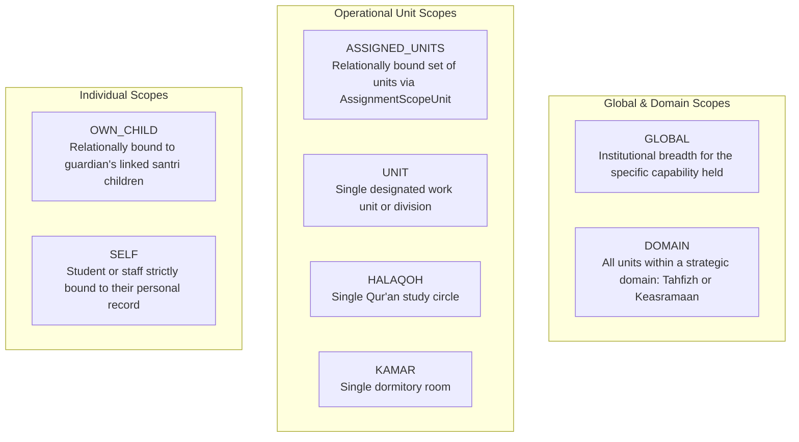

# STQ SCOPE MODEL — SPECIFICATION & CONTEXT BINDING
**Resource Scoping, Context Validation, and Boundary Isolation Rules**  
**Document**: `docs/STQ_SCOPE_MODEL.md`  
**Status**: `PROPOSED — PENDING BUSINESS OWNER / CHATGPT REVIEW`

---

## 1. Canonical Scope Taxonomy

A capability is never evaluated in a vacuum; it is always bound to an explicit **Scope Type**. The STQ Portal defines 8 canonical scope types:



### Detailed Semantics

| Scope Type | Evaluation Predicate | Scope Meaning & Typical Usage |
| :--- | :--- | :--- |
| `GLOBAL` | $\text{Resource} \in \text{Institution}$ | Institutional scope for the **specific granted capability** (Mudir, Admin TU). Does NOT imply unrestricted application access. |
| `DOMAIN` | $\text{Resource}.\text{domainId} == \text{Assignment}.\text{unit}.\text{domainId}$ | Breadth across an entire domain (e.g. Kabid Tahfizh across all halaqoh for supervision). |
| `ASSIGNED_UNITS` | $\text{Resource}.\text{unitId} \in \text{AssignmentScopeUnit}.\text{unitIds}$ | Relationally bound multi-unit supervision (Mudabbir managing multiple Kamar). |
| `HALAQOH` | $\text{Resource}.\text{halaqohId} == \text{Assignment}.\text{unitId}$ | Ordinary Musyrif Tahfizh (`MT`) / Pembina Halaqoh (`PH`). |
| `KAMAR` | $\text{Resource}.\text{kamarId} == \text{Assignment}.\text{unitId}$ | Mudabbir assigned to a single room. |
| `OWN_CHILD` | $\text{Resource}.\text{santriId} \in \text{Guardian}.\text{linkedSantriIds}$ | Wali Santri (`WS`) accessing relationally linked children. Supports 1 guardian $\to$ multiple children. |
| `SELF` | $\text{Resource}.\text{santriId} == \text{Session}.\text{santriId}$ | Santri (`ST`) accessing own records. |

> [!IMPORTANT]
> **Capability Precedence Rule**:
> Capability evaluation strictly precedes scope evaluation. A subject holding `GLOBAL` scope on `health.case.read_aggregate` gains institutional aggregate read access to health records, but zero authority over `tahfizh.reward.issue` or `keasramaan.permission.approve`.

---

## 2. Resource Context Binding & Anti-Tampering

When a Server Action receives a mutation or query parameter (e.g. `santriId: "san-123"`), the system **never trusts caller input**. The Authorization Engine extracts the underlying structural relations directly from the database and binds them to the context:

```typescript
// Example: Validating Setoran Creation Scope Fail-Closed
async function evaluateSetoranScope(session: UserSession, targetSantriId: string): Promise<boolean> {
  // 1. Resolve target student's structural boundaries from authoritative DB
  const santri = await prisma.santri.findUnique({
    where: { id: targetSantriId },
    select: { id: true, halaqohId: true },
  });
  if (!santri || !santri.halaqohId) return false; // Fail-closed

  // 2. Resolve caller's effective halaqoh assignments
  const { unitIds } = await authEngine.resolveScopes(session, "tahfizh.setoran.create");

  // 3. Strict set membership validation
  return unitIds.includes(santri.halaqohId);
}
```

If a client alters `santriId` to point to a student outside their permitted units, the check evaluates to `false` and is rejected with `SCOPE_MISMATCH`.

---

## 3. Gender & Campus Boundary Isolation (`GENDER_COMPLEX_DENIED`)

Pesantren Darul Ulum Cendekia enforces strict physical and administrative segregation between the Male Complex (Putra) and Female Complex (Putri):

1. **Structural Separation**:
   - `Halaqoh Ustadzah Lisa Dwina Fitri` is categorized under `OrgUnitType: HALAQOH` with `genderComplex = 'PUTRI'`.
   - `Asrama Putri` is an `OrgUnit` encompassing female dorm rooms.
2. **Specialized Rejection (`GENDER_COMPLEX_DENIED`)**:
   - Standard `SCOPE_MISMATCH` indicates a generic organizational mismatch within the same campus partition (e.g. Musyrif A editing Musyrif B's halaqoh).
   - `GENDER_COMPLEX_DENIED` explicitly signals a violation of the physical/sharia gender segregation boundary (e.g. an ikhwan personnel attempting to access akhwat dormitory or halaqoh records without an approved cross-complex operational assignment).
3. **Data Protection for Guardian Phone Numbers**:
   - In accordance with privacy rules, guardian contact numbers (`noHpWali`) are redacted at the service layer unless the requester holds `Scope: GLOBAL` (Mudir/Admin), is the assigned musyrif of that specific halaqoh (`Scope: HALAQOH`), or is the guardian themselves (`Scope: OWN_CHILD`).

---

## 4. Fail-Closed Boundary Guarantees

1. **Unassigned Student**: If a student is not yet assigned to any halaqoh (`halaqohId == null`), musyrif with `Scope: HALAQOH` cannot create setoran or view reports for that student. Only managerial staff with `Scope: DOMAIN` (Kabid) or `GLOBAL` (Mudir/Admin) may inspect unassigned students.
2. **Ambiguous Context**: If a request fails to supply sufficient contextual identifiers (e.g., missing `santriId` on a scoped action), the engine defaults to `DENY` with code `INVALID_RESOURCE_CONTEXT`.
