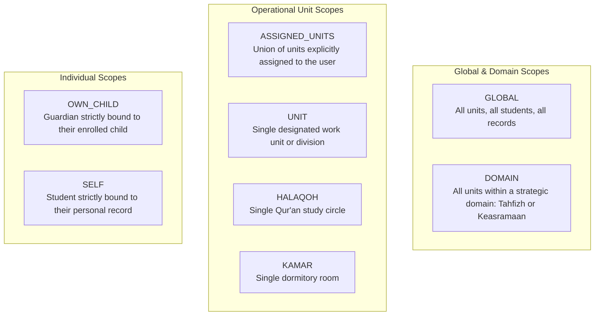

# STQ SCOPE MODEL — SPECIFICATION & CONTEXT BINDING
**Resource Scoping, Context Validation, and Boundary Isolation Rules**  
**Document**: `docs/STQ_SCOPE_MODEL.md`  
**Status**: `ARCHITECTURE_LOCKED`

---

## 1. Scope Taxonomy

A capability is never evaluated in a vacuum; it is always bound to an explicit **Scope Type**. The STQ Portal defines 8 canonical scope types:



### Detailed Semantics

| Scope Type | Evaluation Predicate | Typical Usage |
| :--- | :--- | :--- |
| `GLOBAL` | $\text{Resource} \in \text{Institution}$ | Mudir (`KS`), Administrator (`ADM`), Yayasan (`YAY`). |
| `DOMAIN` | $\text{Resource}.\text{domainId} == \text{Assignment}.\text{unit}.\text{domainId}$ | Kabid Tahfizh (Tahfizh domain), Musyrif Keasramaan (Keasramaan domain). |
| `ASSIGNED_UNITS` | $\text{Resource}.\text{unitId} \in \text{User}.\text{activeUnitIds}$ | Mudabbir managing multiple Kamar; Guru teaching multiple Kelas. |
| `HALAQOH` | $\text{Resource}.\text{halaqohId} == \text{Assignment}.\text{unitId}$ | Ordinary Musyrif Tahfizh (`MT`) / Pembina Halaqoh (`PH`). |
| `KAMAR` | $\text{Resource}.\text{kamarId} == \text{Assignment}.\text{unitId}$ | Mudabbir assigned to a single room. |
| `OWN_CHILD` | $\text{Resource}.\text{santriId} == \text{Session}.\text{santriId}$ | Wali Santri (`WS`). |
| `SELF` | $\text{Resource}.\text{santriId} == \text{Session}.\text{santriId}$ | Santri (`ST`). |

---

## 2. Resource Context Binding & Anti-Tampering

When a Server Action receives a mutation or query parameter (e.g. `santriId: "san-123"`), the system **never trusts caller input**. The Authorization Engine extracts the underlying structural relations directly from the database and binds them to the context:

```typescript
// Example: Validating Setoran Creation Scope
async function evaluateSetoranScope(session: UserSession, targetSantriId: string): Promise<boolean> {
  // 1. Resolve target student's structural boundaries from authoritative DB
  const santri = await prisma.santri.findUnique({
    where: { id: targetSantriId },
    select: { id: true, halaqohId: true },
  });
  if (!santri || !santri.halaqohId) return false; // Fail-closed

  // 2. Resolve caller's effective halaqoh assignments
  const { allowedUnitIds } = await authEngine.resolveScopes(session, "tahfizh.setoran.create");

  // 3. Strict set membership validation
  return allowedUnitIds.includes(santri.halaqohId);
}
```

If a client alters `santriId` to point to a student belonging to a different halaqoh, the evaluation evaluates to `false`, and the request is aborted with `SCOPE_MISMATCH`.

---

## 3. Gender & Campus Boundary Isolation (Putra vs. Putri)

Pesantren Darul Ulum Cendekia maintains strict physical and administrative segregation between the Male Complex (Putra) and Female Complex (Putri):

1. **Structural Separation**:
   - `Halaqoh Ustadzah Lisa Dwina Fitri` (`SAN-0048` s.d. `SAN-0057`) is categorized under `UnitType: HALAQOH` with `gender = 'P'`.
   - `Asrama Putri` is a discrete `OrgUnit` encompassing female dorm rooms.
2. **Operational Roles & Presensi**:
   - The ad-hoc boolean `User.isPetugasPresensiPutri` is canonically mapped to:
     - `Position: PETUGAS_PRESENSI`
     - `Unit: ASRAMA_PUTRI`
     - `Scope: UNIT`
   - A female student holding this assignment can record daily prayer and assembly attendance strictly for students residing in `Asrama Putri`.
   - Any attempt to record presensi for male students is rejected by `SCOPE_MISMATCH`.
3. **Data Protection for Guardian Phone Numbers**:
   - In accordance with privacy rules verified in PR #11/12, guardian contact information (`noHpWali`) is redacted at the service layer unless the requester holds `Scope: GLOBAL` (Mudir/Admin), is the assigned pembina of that specific halaqoh (`Scope: HALAQOH`), or is the guardian themselves (`Scope: OWN_CHILD`).

---

## 4. Fail-Closed Boundary Guarantees

1. **Unassigned Student**: If a student is not yet assigned to any halaqoh (`halaqohId == null`), musyrif with `Scope: HALAQOH` cannot create setoran or view reports for that student. Only managerial staff with `Scope: DOMAIN` (Kabid) or `GLOBAL` (Mudir/Admin) may inspect unassigned students.
2. **Ambiguous Context**: If a request fails to supply sufficient contextual identifiers (e.g., missing `santriId` on a scoped action), the engine defaults to `DENY` with code `INVALID_RESOURCE_CONTEXT`.
